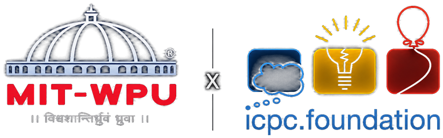
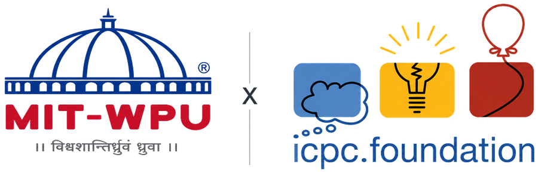
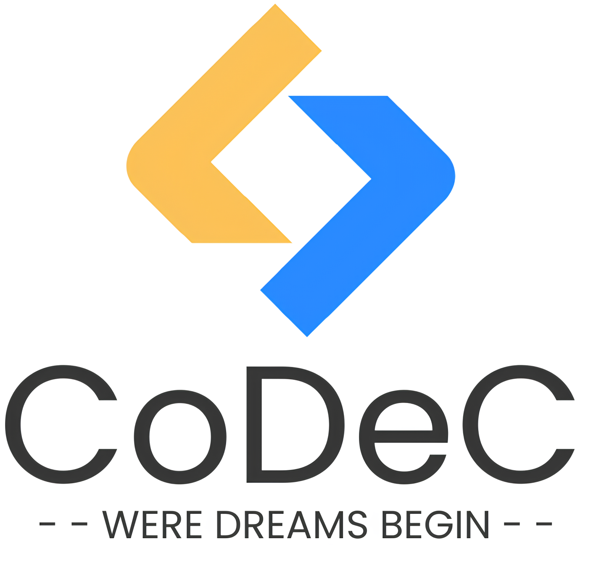
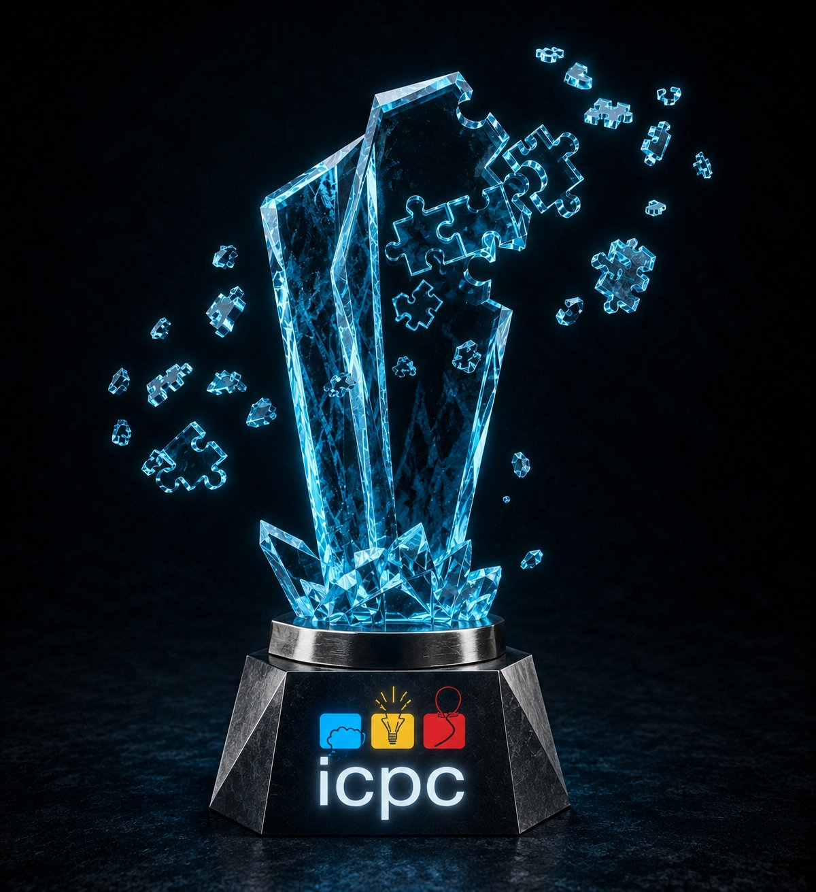
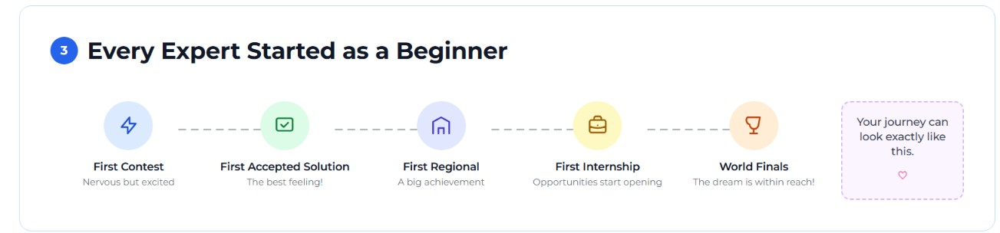

## ./README.md
# ICPC Amritapuri 2026 — MIT-WPU

A static, no-build-step, vanilla HTML/CSS/JS site built by **CoDeC** (MIT-WPU's competitive programming club) in partnership with the **Career Development Centre (CDC)**, to guide MIT-WPU students through ICPC Amritapuri Regionals 2026 — registration, benefits, roadmap, and the people running it.

No framework, no bundler, no `npm install`. Open `index.html` through a local server and it just works.

---

## Quick start

```bash
# from the project root
python3 -m http.server 8000
# then open http://localhost:8000
```

**Do not open `index.html` directly via `file://`.** Several sections (Roadmap, Notifications, Team, Quick Facts) fetch their content from JSON files in `data/`, and browsers block `fetch()` for local files under `file://` due to CORS. Use Live Server (VS Code), `python3 -m http.server`, or any static file server instead.

Each of those sections *does* have hardcoded fallback data baked into its JS module, so the page won't go fully blank even if opened via `file://` — but you'll be looking at stale fallback content, not what's actually in `data/`.

---

## Project structure

```
├── assets/                  # images (logos, photos, banners) — see "Assets" below
в”њв”Ђв”Ђ css/
в”‚   в”њв”Ђв”Ђ reset.css            # minimal modern reset
в”‚   в”њв”Ђв”Ђ variables.css        # design tokens (colors, spacing, type scale, etc.)
в”‚   в”њв”Ђв”Ђ style.css            # global styles + most sections (hero, about, benefits, resources...)
в”‚   в”њв”Ђв”Ђ navbar.css
в”‚   в”њв”Ђв”Ђ components.css       # benefits grid, roadmap timeline, quick facts, help cards
в”‚   в”њв”Ђв”Ђ notifications.css    # toast + bell dashboard
в”‚   в”њв”Ђв”Ђ theme.css             # day/night theme variables + toggle button
в”‚   в””в”Ђв”Ђ final-updates.css    # WhatsApp card, journey card, TEAM cards, hero logo frames, help FAB
в”њв”Ђв”Ђ data/
в”‚   в”њв”Ђв”Ђ roadmap.json          # registration steps (Roadmap section)
в”‚   в”њв”Ђв”Ђ notifications.json    # announcements (toast + bell dashboard)
в”‚   в””в”Ђв”Ђ team.json              # Faculty / Ambassadors / any other groups (Team section)
в”њв”Ђв”Ђ js/
в”‚   в”њв”Ђв”Ђ config.js              # SITE_CONFIG: links, contact info, quick-facts text
в”‚   в”њв”Ђв”Ђ app.js                  # boots every module in order, resilient to individual failures
в”‚   в”њв”Ђв”Ђ utils/
в”‚   в”‚   в”њв”Ђв”Ђ dom.js              # DOM helpers: qs/qsa/create/fetchJSON/debounce/onIntersect
│   │   └── markdown.js         # markdown-lite renderer (see below) — used by every data-driven module
в”‚   в”њв”Ђв”Ђ modules/
в”‚   в”‚   в”њв”Ђв”Ђ navbar.js           # sticky nav, mobile menu, flyouts, scroll-based active link
в”‚   в”‚   в”њв”Ђв”Ђ theme.js             # day/night toggle, persisted in localStorage
в”‚   в”‚   в”њв”Ђв”Ђ roadmap.js           # renders data/roadmap.json into the timeline
в”‚   в”‚   в”њв”Ђв”Ђ notifications.js     # renders data/notifications.json into toast + bell dashboard
в”‚   в”‚   в””в”Ђв”Ђ team.js               # renders data/team.json into the Team section (generic groups)
в”‚   в””в”Ђв”Ђ animations/
│       ├── floating.js          # (not covered in this handoff — decorative float-el elements)
│       └── scroll.js             # (not covered in this handoff — drives [data-reveal] fade-ins)
в””в”Ђв”Ђ index.html
```

**Script load order matters** (see the bottom of `index.html`): `config.js` в†’ `utils/dom.js` в†’ `utils/markdown.js` в†’ `modules/*` в†’ `animations/*` в†’ `app.js`. Each module attaches itself to `window` (e.g. `window.TeamModule`), and `app.js` calls `.init()` on each in `js/app.js`'s `init()` function.

`app.js`'s `init()` wraps every module's init call in a `safeInit()` try/catch — **one module throwing (e.g. a missing script file → `ReferenceError`) no longer breaks the rest of the boot sequence**, including `ScrollAnimation.init()` (which is what removes the `opacity: 0` from every `[data-reveal]` element — if that never runs, the whole page looks "stuck").

---

## The markdown-lite renderer (`js/utils/markdown.js`)

A tiny, **intentionally limited** formatter (not real Markdown) for any text that comes from a JSON data file or `config.js`. It is NOT applied to hardcoded copy inside `index.html` (About, Benefits, Help, etc.) — only to data-driven content.

Two supported patterns:

| Syntax | Renders as |
|---|---|
| `[label](https://example.com)` | `<a href="https://example.com" target="_blank" rel="noopener">label</a>` |
| `=(#3e8ef7)<some text>==` | `<span style="color:#3e8ef7">some text</span>` (accepts `#hex`, bare `hex`, or a CSS color keyword like `gold`) |

Every string is **HTML-escaped first**, then only these two patterns are re-expanded — safe to pipe arbitrary JSON straight into `innerHTML`. Anything that doesn't match the pattern (e.g. a `javascript:` URL, or a nonsense color token) is left as literal escaped text rather than rendered.

Currently wired into:
- `roadmap.js` — step `title` / `description`
- `notifications.js` — dashboard item `title` / `message`
- `team.js` — member `name` / `role`, group `title`
- `app.js`'s `applyConfigLinks()` — any `[data-fact]` element sourced from `SITE_CONFIG.facts`

If you add a new data-driven module, use `MD.render(str)` (returns an HTML string) or `MD.applyTo(el, str)` (sets `el.innerHTML` directly) instead of `el.textContent = str`.

---

## `data/team.json` — the Team section

Fully generic: **any number of groups**, each rendered as a title + a grid of cards. Adding a new category (Volunteers, Mentors, whatever) is a JSON-only change — no HTML/JS edits needed.

```json
{
  "groups": [
    {
      "id": "faculty",
      "title": "Faculty & Coordinators",
      "members": [
        {
          "name": "Person Name",
          "role": "Their role/title",
          "photo": "assets/their-photo.png",   // optional — falls back to an initials avatar
          "phone": "9999999999",                 // optional — renders as a tap-to-call link
          "email": "person@example.com",          // optional — renders as a mailto link
          "link": "https://linkedin.com/in/..."   // optional — makes the WHOLE CARD clickable
        }
      ]
    }
  ]
}
```

Behavior notes:
- **No `photo`** в†’ the card shows a colored circle with the person's initials instead of a broken image.
- **`phone` / `email`** в†’ shown as small contact links inside the card; clicking them does *not* trigger the card's own `link` click (they call `stopPropagation()`).
- **`link`** в†’ the entire card becomes clickable/keyboard-focusable (`tabindex`, `role="link"`, opens in a new tab). Omit it (or set it to `"#"`) to leave the card non-clickable. This is what makes faculty cards, ambassador cards, and any future group all behave identically.
- Card markup/classes (`.team__grid`, `.team-card`, `.team-card__photo`, etc.) live in `css/final-updates.css` — unchanged from the original hand-written markup, so no CSS edits were needed when this became data-driven.

**Known outstanding TODO:** `assets/faculty-Kishanprasad Gunale.png` has a space in the filename. It generally works in a browser but is worth renaming to something like `faculty-kishanprasad-gunale.png` to avoid edge cases with some servers/tools.

---

## `data/roadmap.json` / `data/notifications.json`

Same idea, simpler shape:
- `roadmap.json` в†’ `{ steps: [{ step, icon, title, description }] }`, rendered in order by `roadmap.js` into the timeline under `[data-roadmap-list]`.
- `notifications.json` в†’ a flat array of `{ id, type ("alert"|"info"|"warning"), title, message, date, dateLabel, link, read }`. `link` is looked up against `SITE_CONFIG.links` in `config.js` (or treated as an anchor if it starts with `#`). Read/unread state is tracked client-side in `localStorage` (`icpc-notifications-read`), separate from the `read` flag in the JSON (which is just the initial state for first-time visitors).

---

## `js/config.js` — `SITE_CONFIG`

Central place for links, contact info, and the text shown in the Quick Facts table (`data-fact` elements) and any `data-link` / `data-video-src` elements in `index.html`. **Several values are still placeholders** and need to be filled in before this is truly final:

- `links.howToRegister` — `[HOW_TO_REGISTER_GUIDE_URL]`
- `links.howToRegisterVideo` — `[HOW_TO_REGISTER_VIDEO_ID]`
- `links.whatIsIcpcVideo` — `[WHAT_IS_ICPC_VIDEO_ID]`
- `links.amritapuri2024Highlights` — `[ICPC_2024_HIGHLIGHTS_VIDEO_ID]`
- `links.needATeamForm` / `links.helpForm` — currently both point at the same placeholder Google Form link; confirm whether that's intentional or they should be two separate forms.
- `facts.registrationFee`, `facts.registrationLink`, `facts.registrationDeadline`, `facts.onlinePrelims`, `facts.onsiteSites` — marked "to be confirmed" pending the official CoDeC Welcome Kit.

---

## Hero — CDC / CoDeC logo frames

Two small gold-bordered, gently floating frames sit centered above the "Solve. Collaborate. Conquer." title, pulling from:
- `assets/cdc_banner.png` (shown first / higher, on the left)
- `assets/codec_banner.png` (shown second / offset lower, on the right)

Markup: `.hero__logo-frames` in `index.html` (inside `<section class="hero">`, before `.hero__grid`). Styling/animation: section "4. HERO — CDC / CoDeC GOLDEN LOGO FRAMES" in `css/final-updates.css`. Collapses to a static, centered row above the hero copy at ≤900px; respects `prefers-reduced-motion`.

**If these look broken/missing:** the files must exist at exactly `assets/cdc_banner.png` and `assets/codec_banner.png` (case-sensitive). A 404 in the console for either filename means the file isn't there or is misnamed.

---

## Assets checklist

Files referenced by the current code that must exist in `assets/` for everything to render correctly:

| File | Used by |
|---|---|
| `hero-bg.jpg` / `hero-bg-day.jpg` | Hero background (night/day theme) |
| `icpc-trophy.jpg` | Hero visual |
| `journey-preview.jpg` | Roadmap section "journey" card |
| `logo-night.png` / `logo-day.png` | Navbar brand logo (theme-swapped) |
| `cdc_banner.png` / `codec_banner.png` | Hero golden logo frames |
| `team-harshvardhan.png` | Team в†’ Ambassadors |
| `team-rugved.jpg` | Team в†’ Ambassadors |
| `faculty-Kishanprasad Gunale.png` | Team в†’ Faculty (вљ пёЏ space in filename, see above) |

---

## Things to know / gotchas for whoever picks this up next

1. **`file://` won't fetch JSON.** Always serve locally. See "Quick start."
2. **`app.js` init order is intentional and defensive.** If a new module throws during `init()`, it's caught and logged, not fatal to the rest of the page — but the module itself obviously still won't render. Check the console for `[App] <ModuleName> failed to init:`.
3. **Adding a new data-driven module?** Follow the `roadmap.js` / `team.js` pattern: fetch via `DOM.fetchJSON`, fall back to a hardcoded `FALLBACK_DATA` constant if the fetch fails, render via `DOM.create(...)`, and pipe any user-facing string through `MD.render()` / `MD.applyTo()` rather than raw `textContent`/`innerHTML`.
4. **`css/style.css` and `css/components.css` were intentionally left mostly untouched** during this round of work — new/changed styling was added to `css/final-updates.css` instead, to keep the diff contained. `css/components.css` still has unused `.faculty-card` / `.faculty__grid` rules left over from before Team became data-driven — harmless (unused CSS), but fine to remove if you want to tidy up.
5. **This README itself is a snapshot** — as of the point this was written, Team/Roadmap/Notifications are data-driven and markdown-lite-rendered, and the hero has the CDC/CoDeC logo frames. If more changes land after this, update this file too so it stays trustworthy for the next handoff.


## ./data/notifications.json
[
  {
    "id": "n1",
    "type": "alert",
    "title": "Registrations Open!",
    "message": "Lock in your spot before the deadline — form your team of three and register today.",
    "date": "2026-07-26",
    "dateLabel": "Today",
    "link": "registration",
    "read": false
  },
  {
    "id": "n2",
    "type": "info",
    "title": "Preliminary Round Dates Announced",
    "message": "The online preliminary round schedule is now live — check the Roadmap section for details.",
    "date": "2026-07-24",
    "dateLabel": "2 days ago",
    "link": "roadmap",
    "read": false
  },
  {
    "id": "n3",
    "type": "info",
    "title": "Practice Session Tomorrow",
    "message": "Join CoDeC's weekly practice contest to warm up before the preliminary round.",
    "date": "2026-07-19",
    "dateLabel": "1 week ago",
    "link": "resources",
    "read": true
  },
  {
    "id": "n4",
    "type": "warning",
    "title": "Team Formation Guidelines",
    "message": "New teams must be finalized before the registration deadline — review the guidelines if you still need teammates.",
    "date": "2026-07-12",
    "dateLabel": "2 weeks ago",
    "link": "needATeamForm",
    "read": true
  }
]


## ./data/team.json
{
  "groups": [
    {
      "id": "faculty",
      "title": "Faculty & Coordinators",
      "members": [
        {
          "name": "Kishanprasad Gunale Sir",
          "role": "Director – Career Development Centre (CDC), MIT-WPU",
          "photo": "assets/faculty-Kishanprasad-Gunale.png",
          "link": "https://www.linkedin.com/in/kishanprasad-gunale-98937271/"
        }
      ]
    },
    {
      "id": "ambassadors",
      "title": "Student Team — Campus Ambassadors",
      "members": [
        {
          "name": "Harshvardhan Rathod",
          "role": "Campus Ambassador",
          "photo": "assets/team-harshvardhan.png",
          "phone": "7709285391",
          "email": "hmr280606@gmail.com",
          "link": "https://happiocrz007.github.io"
        },
        {
          "name": "Rugved Dusane",
          "role": "Campus Ambassador",
          "photo": "assets/team-rugved.jpg",
          "phone": "9673480827",
          "email": "ultimaterd8@gmail.com",
          "link": "https://www.linkedin.com/in/rugveddusane/"
        }
      ]
    }
  ]
}


## ./data/roadmap.json
{
  "steps": [
    {
      "step": 1,
      "icon": "users",
      "title": "Form your team",
      "description": "Put together a team of three students. Teams can be interdisciplinary but every member must be a currently enrolled student at MIT-WPU."
    },
    {
      "step": 2,
      "icon": "link",
      "title": "Register on the official ICPC portal",
      "description": "Complete your team registration on the official ICPC portal. The link will be shared in the CoDeC Welcome Kit — check the Quick Facts section below."
    },
    {
      "step": 3,
      "icon": "credit-card",
      "title": "Pay the registration fee",
      "description": "Submit the registration fee per the instructions on the portal. The exact amount will be confirmed and shared in the Welcome Kit."
    },
    {
      "step": 4,
      "icon": "calendar",
      "title": "Confirm before the deadline",
      "description": "Make sure your team's registration and payment are complete before the deadline. Dates will be announced by CoDeC and CDC."
    },
    {
      "step": 5,
      "icon": "book",
      "title": "Prepare for the Preliminary Round",
      "description": "Look out for prep sessions and practice resources shared by CoDeC and AlgoZenith to get your team ready for the online Preliminary Round."
    }
  ]
}


## ./css/footer.css
/* ============================================
   Footer
   ============================================ */

.footer {
  position: relative;
  border-top: 1px solid var(--color-border);
  padding-block: var(--space-2xl) var(--space-lg);
  z-index: 1;
}

.footer__grid {
  display: grid;
  grid-template-columns: 1.4fr 1fr 1fr 1fr;
  gap: var(--space-lg);
  padding-bottom: var(--space-xl);
}

.footer__brand-text {
  font-family: var(--font-display);
  font-size: 1.25rem;
  margin-bottom: var(--space-sm);
}

.footer__about {
  color: var(--color-text-muted);
  font-size: var(--fs-small);
  max-width: 320px;
  line-height: 1.6;
}

.footer__col h5 {
  font-size: var(--fs-small);
  text-transform: uppercase;
  letter-spacing: 0.08em;
  color: var(--color-text-muted);
  margin-bottom: var(--space-sm);
}

.footer__col ul {
  display: flex;
  flex-direction: column;
  gap: var(--space-xs);
}

.footer__col a {
  color: var(--color-text-secondary);
  font-size: var(--fs-body);
  transition: color var(--duration-fast);
}

.footer__col a:hover {
  color: var(--color-blue-bright);
}

.footer__bottom {
  display: flex;
  align-items: center;
  justify-content: space-between;
  flex-wrap: wrap;
  gap: var(--space-sm);
  padding-top: var(--space-lg);
  border-top: 1px solid var(--color-border);
}

.footer__copy {
  color: var(--color-text-muted);
  font-size: var(--fs-xs);
}

.footer__social {
  display: flex;
  gap: var(--space-sm);
}

.footer__social a {
  width: 36px;
  height: 36px;
  border-radius: 50%;
  border: 1px solid var(--color-border-strong);
  display: flex;
  align-items: center;
  justify-content: center;
  color: var(--color-text-secondary);
  transition: color var(--duration-fast), border-color var(--duration-fast), transform var(--duration-fast);
}

.footer__social a:hover {
  color: var(--color-blue-bright);
  border-color: var(--color-blue-bright);
  transform: translateY(-2px);
}

.footer__social svg {
  width: 16px;
  height: 16px;
}

/* Subtle watermark */
.footer__watermark {
  position: absolute;
  right: var(--space-lg);
  bottom: var(--space-lg);
  font-family: var(--font-display);
  font-size: 8rem;
  line-height: 1;
  font-weight: 700;
  color: transparent;
  -webkit-text-stroke: 1px rgba(255, 255, 255, 0.04);
  pointer-events: none;
  z-index: -1;
  user-select: none;
  display: none;
}

@media (min-width: 900px) {
  .footer__watermark {
    display: block;
  }
}

@media (max-width: 900px) {
  .footer__grid {
    grid-template-columns: 1fr 1fr;
  }
}

@media (max-width: 560px) {
  .footer__grid {
    grid-template-columns: 1fr;
  }
  .footer__bottom {
    flex-direction: column;
    align-items: flex-start;
  }
}


## ./css/navbar.css
/* ============================================
   Navbar
   ============================================ */

.navbar {
  position: sticky;
  top: 0;
  z-index: 100;
  padding-block: var(--space-md);
  background: rgba(6, 7, 12, 0.6);
  backdrop-filter: blur(16px);
  -webkit-backdrop-filter: blur(16px);
  border-bottom: 1px solid transparent;
  transition: background var(--duration-fast), border-color var(--duration-fast), padding var(--duration-fast);
}

.navbar.is-scrolled {
  background: rgba(6, 7, 12, 0.85);
  border-bottom-color: var(--color-border);
  padding-block: var(--space-sm);
}

.navbar__inner {
  display: flex;
  align-items: center;
  justify-content: space-between;
  gap: var(--space-lg);
}

.navbar__brand {
  display: flex;
  align-items: center;
  gap: var(--space-sm);
  font-family: var(--font-display);
}

.navbar__logo {
  height: 34px;
  width: auto;
  display: none;
}

/* Only the variant matching the active theme is shown (default: night).
   Day-mode override lives in css/theme.css. */
.navbar__logo--night {
  display: block;
}

@media (min-width: 720px) {
  .navbar__logo {
    height: 40px;
  }
}

/* ---- Links ---- */
.navbar__links {
  display: flex;
  align-items: center;
  gap: var(--space-lg);
  list-style: none;
}

.navbar__link-item {
  position: relative;
}

.navbar__link {
  display: flex;
  align-items: center;
  gap: 4px;
  font-size: var(--fs-body);
  color: var(--color-text-secondary);
  padding-block: var(--space-xs);
  transition: color var(--duration-fast);
}

.navbar__link:hover,
.navbar__link.is-active {
  color: var(--color-text-primary);
}

.navbar__link.is-active {
  color: var(--color-blue-bright);
}

.navbar__link svg {
  width: 12px;
  height: 12px;
  transition: transform var(--duration-fast);
}

.navbar__link-item.is-open .navbar__link svg {
  transform: rotate(180deg);
}

/* ---- Flyout ---- */
.navbar__flyout {
  position: absolute;
  top: calc(100% + 14px);
  left: 50%;
  transform: translate(-50%, 8px);
  min-width: 260px;
  background: var(--color-surface-raised);
  border: 1px solid var(--color-border-strong);
  border-radius: var(--radius-md);
  padding: var(--space-sm);
  box-shadow: var(--shadow-card);
  opacity: 0;
  visibility: hidden;
  pointer-events: none;
  transition: opacity var(--duration-fast) var(--ease-out), transform var(--duration-fast) var(--ease-out), visibility var(--duration-fast);
}

.navbar__link-item.is-open .navbar__flyout {
  opacity: 1;
  visibility: visible;
  pointer-events: auto;
  transform: translate(-50%, 0);
}

.navbar__flyout a {
  display: block;
  padding: var(--space-sm);
  border-radius: var(--radius-sm);
  font-size: var(--fs-small);
  color: var(--color-text-secondary);
  transition: background var(--duration-fast), color var(--duration-fast);
}

.navbar__flyout a:hover {
  background: rgba(255, 255, 255, 0.05);
  color: var(--color-text-primary);
}

.navbar__flyout-title {
  display: block;
  font-weight: 600;
  color: var(--color-text-primary);
  margin-bottom: 2px;
}

.navbar__flyout-desc {
  display: block;
  color: var(--color-text-muted);
  font-size: var(--fs-xs);
}

/* ---- Right side ---- */
.navbar__actions {
  display: flex;
  align-items: center;
  gap: var(--space-sm);
}

.navbar__toggle {
  display: none;
  flex-direction: column;
  gap: 5px;
  padding: var(--space-xs);
}

.navbar__toggle span {
  width: 22px;
  height: 2px;
  background: var(--color-text-primary);
  border-radius: 2px;
  transition: transform var(--duration-fast), opacity var(--duration-fast);
}

.navbar.is-menu-open .navbar__toggle span:nth-child(1) {
  transform: translateY(7px) rotate(45deg);
}
.navbar.is-menu-open .navbar__toggle span:nth-child(2) {
  opacity: 0;
}
.navbar.is-menu-open .navbar__toggle span:nth-child(3) {
  transform: translateY(-7px) rotate(-45deg);
}

/* ---- Mobile ---- */
@media (max-width: 900px) {
  .navbar__toggle {
    display: flex;
  }

  .navbar__links {
    position: fixed;
    top: var(--nav-height, 72px);
    left: 0;
    right: 0;
    bottom: 0;
    flex-direction: column;
    align-items: stretch;
    gap: 0;
    background: var(--color-bg-alt);
    padding: var(--space-md);
    transform: translateX(100%);
    transition: transform var(--duration-med) var(--ease-out);
    overflow-y: auto;
  }

  .navbar.is-menu-open .navbar__links {
    transform: translateX(0);
  }

  .navbar__link {
    padding-block: var(--space-md);
    border-bottom: 1px solid var(--color-border);
    justify-content: space-between;
    width: 100%;
  }

  .navbar__flyout {
    position: static;
    transform: none;
    width: 100%;
    box-shadow: none;
    margin-top: 0;
    max-height: 0;
    padding: 0;
    border: none;
    overflow: hidden;
  }

  .navbar__link-item.is-open .navbar__flyout {
    max-height: 400px;
    padding: var(--space-sm);
    margin-bottom: var(--space-sm);
    border: 1px solid var(--color-border);
  }

  .navbar__actions .btn-primary {
    width: 100%;
  }
}


## ./css/reset.css
/* ============================================
   Minimal modern reset
   ============================================ */

*,
*::before,
*::after {
  box-sizing: border-box;
  margin: 0;
  padding: 0;
}

html {
  -webkit-text-size-adjust: 100%;
  scroll-behavior: smooth;
}

@media (prefers-reduced-motion: reduce) {
  html {
    scroll-behavior: auto;
  }
  *,
  *::before,
  *::after {
    animation-duration: 0.01ms !important;
    animation-iteration-count: 1 !important;
    transition-duration: 0.01ms !important;
    scroll-behavior: auto !important;
  }
}

body {
  min-height: 100vh;
  line-height: 1.5;
  -webkit-font-smoothing: antialiased;
}

img,
picture,
svg,
video {
  display: block;
  max-width: 100%;
}

input,
button,
textarea,
select {
  font: inherit;
  color: inherit;
}

button {
  background: none;
  border: none;
  cursor: pointer;
}

a {
  color: inherit;
  text-decoration: none;
}

ul,
ol {
  list-style: none;
}

table {
  border-collapse: collapse;
  width: 100%;
}

h1, h2, h3, h4, h5, h6 {
  font-weight: inherit;
  overflow-wrap: break-word;
}

:focus-visible {
  outline: 2px solid var(--color-blue-bright);
  outline-offset: 3px;
  border-radius: 4px;
}


## ./css/theme.css
/* ============================================
   Day / Night Theme
   Default site theme is "night" (the original dark
   design). Adding data-theme="day" to <html> (done
   by js/modules/theme.js, persisted in localStorage)
   swaps the design tokens below to a light palette
   and swaps the hero background photo + overlay.
   ============================================ */

:root[data-theme="day"] {
  /* ---- Surfaces ---- */
  --color-bg: #f6f7fb;
  --color-bg-alt: #eceef6;
  --color-surface: #ffffff;
  --color-surface-raised: #ffffff;
  --color-border: rgba(13, 18, 32, 0.08);
  --color-border-strong: rgba(13, 18, 32, 0.14);

  /* ---- Text ---- */
  --color-text-primary: #0d1220;
  --color-text-secondary: #454f66;
  --color-text-muted: #6b7591;

  /* ---- Shadow / glow (softer for a light surface) ---- */
  --shadow-card: 0 8px 30px rgba(20, 24, 45, 0.1);
  --glow-blue: 0 0 40px rgba(62, 142, 247, 0.18);

  /* ---- Hero background: swap to the light trophy photo + light overlay ---- */
  --hero-bg-image: url("../assets/hero-bg-day.jpg");
  --hero-overlay: linear-gradient(
    180deg,
    rgba(246, 247, 251, 0.55) 0%,
    rgba(246, 247, 251, 0.45) 45%,
    rgba(246, 247, 251, 0.8) 100%
  );
}

/* ---- Ambient body glow: tone down for a light background ---- */
:root[data-theme="day"] body::before {
  opacity: 0.5;
}

/* ---------------------------------------------
   Component overrides
   A handful of places use hardcoded rgba(255,255,255,*)
   / rgba(6,7,12,*) washes that assume a dark surface.
   Flip those specifically for day mode.
   --------------------------------------------- */

/* Navbar sticky background */
:root[data-theme="day"] .navbar {
  background: rgba(246, 247, 251, 0.7);
}
:root[data-theme="day"] .navbar.is-scrolled {
  background: rgba(246, 247, 251, 0.92);
}

/* Secondary button wash */
:root[data-theme="day"] .btn-secondary {
  background: rgba(13, 18, 32, 0.03);
}
:root[data-theme="day"] .btn-secondary:hover {
  background: rgba(13, 18, 32, 0.06);
}

/* Navbar flyout hover */
:root[data-theme="day"] .navbar__flyout a:hover {
  background: rgba(13, 18, 32, 0.04);
}

/* Navbar logo: swap to the light-background variant in day mode */
:root[data-theme="day"] .navbar__logo--night {
  display: none;
}
:root[data-theme="day"] .navbar__logo--day {
  display: block;
}

/* Bell + theme toggle buttons */
:root[data-theme="day"] .navbar__bell,
:root[data-theme="day"] .navbar__theme-toggle {
  background: rgba(13, 18, 32, 0.04);
}
:root[data-theme="day"] .navbar__bell:hover,
:root[data-theme="day"] .navbar__theme-toggle:hover {
  background: rgba(13, 18, 32, 0.08);
}
:root[data-theme="day"] .navbar__bell-badge {
  border-color: var(--color-bg);
}

/* Toast + dashboard close buttons */
:root[data-theme="day"] .notif-toast__close,
:root[data-theme="day"] .notif-dash__close {
  background: rgba(13, 18, 32, 0.04);
}
:root[data-theme="day"] .notif-toast__close:hover,
:root[data-theme="day"] .notif-dash__close:hover {
  background: rgba(13, 18, 32, 0.08);
}

/* Notification toast progress track */
:root[data-theme="day"] .notif-toast__progress {
  background: rgba(13, 18, 32, 0.06);
}

/* Dashboard overlay + shadow */
:root[data-theme="day"] .notif-overlay {
  background: rgba(20, 24, 45, 0.35);
}
:root[data-theme="day"] .notif-dash {
  box-shadow: -20px 0 60px rgba(20, 24, 45, 0.18);
}
:root[data-theme="day"] .notif-dash__item:hover {
  background: rgba(13, 18, 32, 0.03);
}

/* Footer watermark stroke */
:root[data-theme="day"] .footer__watermark {
  -webkit-text-stroke: 1px rgba(13, 18, 32, 0.06);
}

/* ============================================
   Theme toggle button (navbar)
   ============================================ */
.navbar__theme-toggle {
  position: relative;
  display: flex;
  align-items: center;
  justify-content: center;
  width: 40px;
  height: 40px;
  border-radius: 50%;
  font-size: 1.05rem;
  color: var(--color-text-secondary);
  background: rgba(255, 255, 255, 0.05);
  border: 1px solid var(--color-border);
  transition: background var(--duration-fast), color var(--duration-fast), transform var(--duration-fast);
}

.navbar__theme-toggle:hover {
  background: rgba(255, 255, 255, 0.1);
  color: var(--color-text-primary);
  transform: translateY(-1px) rotate(15deg);
}

.navbar__theme-toggle .theme-icon-day,
.navbar__theme-toggle .theme-icon-night {
  display: none;
}

/* Night (default): show the moon, clicking switches to day */
.navbar__theme-toggle .theme-icon-night {
  display: block;
}

/* Day mode: show the sun, clicking switches back to night */
:root[data-theme="day"] .navbar__theme-toggle .theme-icon-night {
  display: none;
}
:root[data-theme="day"] .navbar__theme-toggle .theme-icon-day {
  display: block;
}

@media (prefers-reduced-motion: reduce) {
  .hero__bg {
    transition: none;
  }
}


## ./css/final-updates.css
/* ============================================
   Final Updates
   Team section, WhatsApp community card, roadmap
   "journey" preview card, and the floating help
   button.
   ============================================ */

/* ---------------------------------------------
   1. WHATSAPP COMMUNITY CARD
   --------------------------------------------- */
.whatsapp-card {
  display: flex;
  align-items: center;
  gap: var(--space-md);
  max-width: 640px;
  margin: 0 auto var(--space-lg);
  padding: var(--space-md) var(--space-lg);
  border-radius: var(--radius-lg);
  background: linear-gradient(135deg, rgba(37, 211, 102, 0.14), rgba(37, 211, 102, 0.04));
  border: 1px solid rgba(37, 211, 102, 0.35);
  box-shadow: var(--shadow-card);
  transition: transform var(--duration-fast) var(--ease-out), box-shadow var(--duration-fast) var(--ease-out);
}

.whatsapp-card:hover {
  transform: translateY(-3px);
  box-shadow: 0 0 40px rgba(37, 211, 102, 0.25);
}

.whatsapp-card__icon {
  flex-shrink: 0;
  width: 52px;
  height: 52px;
  border-radius: 50%;
  display: flex;
  align-items: center;
  justify-content: center;
  background: #25d366;
  color: #fff;
}

.whatsapp-card__body {
  flex: 1;
  display: flex;
  flex-direction: column;
  gap: 2px;
  text-align: left;
}

.whatsapp-card__title {
  font-family: var(--font-display);
  font-size: 1.05rem;
  font-weight: 600;
  color: var(--color-text-primary);
}

.whatsapp-card__desc {
  font-size: var(--fs-small);
  color: var(--color-text-secondary);
}

.whatsapp-card__arrow {
  flex-shrink: 0;
  color: #25d366;
  transition: transform var(--duration-fast) var(--ease-out);
}

.whatsapp-card:hover .whatsapp-card__arrow {
  transform: translateX(4px);
}

@media (max-width: 560px) {
  .whatsapp-card {
    flex-wrap: wrap;
  }
  .whatsapp-card__arrow {
    display: none;
  }
}

/* ---------------------------------------------
   2. ROADMAP — JOURNEY PREVIEW CARD
   --------------------------------------------- */
.journey-card {
  max-width: 720px;
  margin-top: var(--space-lg);
  padding: var(--space-sm);
  border-radius: var(--radius-lg);
  background: var(--color-surface);
  border: 1px solid var(--color-border);
  box-shadow: var(--shadow-card);
}

.journey-card img {
  display: block;
  width: 100%;
  height: auto;
  border-radius: var(--radius-md);
}

.journey-card__caption {
  margin-top: var(--space-sm);
  padding-inline: var(--space-xs);
  font-size: var(--fs-small);
  color: var(--color-text-secondary);
  text-align: center;
}

/* ---------------------------------------------
   3. TEAM SECTION
   --------------------------------------------- */
.team__group-title {
  font-family: var(--font-display);
  font-size: 1.1rem;
  font-weight: 600;
  margin-top: var(--space-xl);
  margin-bottom: var(--space-md);
  color: var(--color-text-primary);
}

.team__group-title:first-of-type {
  margin-top: var(--space-lg);
}

.faculty__grid {
  display: grid;
  grid-template-columns: repeat(3, 1fr);
  gap: var(--space-md);
}

.faculty-card {
  padding: var(--space-md);
  border-radius: var(--radius-lg);
  background: var(--color-surface);
  border: 1px solid var(--color-border);
  transition: transform var(--duration-fast) var(--ease-out), border-color var(--duration-fast);
}

.faculty-card:hover {
  transform: translateY(-3px);
  border-color: var(--color-border-strong);
}

.faculty-card h4 {
  font-family: var(--font-display);
  font-size: 1rem;
  font-weight: 600;
  margin-bottom: 4px;
  color: var(--color-text-primary);
}

.faculty-card p {
  font-size: var(--fs-small);
  color: var(--color-text-secondary);
  line-height: 1.5;
}

.team__grid {
  display: grid;
  grid-template-columns: repeat(auto-fit, minmax(240px, 1fr));
  gap: var(--space-lg);
  max-width: 720px;
}

.team-card {
  padding: var(--space-lg);
  border-radius: var(--radius-lg);
  background: var(--color-surface);
  border: 1px solid var(--color-border);
  text-align: center;
  transition: transform var(--duration-fast) var(--ease-out), border-color var(--duration-fast);
}

.team-card:hover {
  transform: translateY(-4px);
  border-color: var(--color-border-strong);
  box-shadow: var(--shadow-card);
}

.team-card--clickable {
  cursor: pointer;
}

.team-card--clickable:hover {
  border-color: var(--color-blue-bright);
}

.team-card__photo {
  width: 96px;
  height: 96px;
  margin: 0 auto var(--space-sm);
  border-radius: 50%;
  overflow: hidden;
  border: 2px solid var(--color-border-strong);
}

.team-card__photo img {
  width: 100%;
  height: 100%;
  object-fit: cover;
}

.team-card__photo--placeholder {
  display: flex;
  align-items: center;
  justify-content: center;
  background: var(--gradient-primary);
  color: #fff;
  font-family: var(--font-display);
  font-weight: 700;
  font-size: 1.4rem;
  letter-spacing: 0.02em;
}

.team-card h4 {
  font-family: var(--font-display);
  font-size: 1.05rem;
  font-weight: 600;
  color: var(--color-text-primary);
}

.team-card__role {
  font-size: var(--fs-small);
  color: var(--color-blue-bright);
  margin-bottom: var(--space-sm);
}

.team-card__contact {
  display: flex;
  flex-direction: column;
  gap: var(--space-xs);
  align-items: center;
}

.team-card__contact a {
  display: inline-flex;
  align-items: center;
  gap: 6px;
  font-size: var(--fs-small);
  color: var(--color-text-secondary);
  transition: color var(--duration-fast);
}

.team-card__contact a:hover {
  color: var(--color-blue-bright);
}

.team-card__contact svg {
  flex-shrink: 0;
}

@media (max-width: 720px) {
  .faculty__grid {
    grid-template-columns: 1fr;
  }
}

/* ---------------------------------------------
   4. HERO — CDC / CoDeC GOLDEN LOGO FRAMES
   --------------------------------------------- */
.hero__logo-frames {
  position: absolute;
  top: calc(var(--nav-height, 72px) + var(--space-md));
  left: 50%;
  transform: translateX(-50%);
  z-index: 2;
  display: flex;
  align-items: flex-start;
  justify-content: center;
  gap: var(--space-md);
}

.logo-frame {
  width: 72px;
  height: 72px;
  padding: 6px;
  border-radius: var(--radius-md);
  border: 2px solid transparent;
  background:
    linear-gradient(var(--color-surface-raised), var(--color-surface-raised)) padding-box,
    linear-gradient(135deg, #ffe9a8, var(--color-yellow), #b8860b) border-box;
  box-shadow: 0 0 24px rgba(255, 201, 60, 0.35), var(--shadow-card);
  display: flex;
  align-items: center;
  justify-content: center;
  animation: logoFrameFloat 4.5s ease-in-out infinite;
  transition: transform var(--duration-fast) var(--ease-out), box-shadow var(--duration-fast) var(--ease-out);
}

.logo-frame:hover {
  transform: translateY(-4px) scale(1.04);
  box-shadow: 0 0 34px rgba(255, 201, 60, 0.5), var(--shadow-card);
}

.logo-frame img {
  width: 100%;
  height: 100%;
  object-fit: contain;
  border-radius: calc(var(--radius-md) - 6px);
}

.logo-frame--cdc {
  animation-delay: 0s;
}

.logo-frame--codec {
  margin-top: var(--space-lg);
  animation-delay: 0.7s;
}

@keyframes logoFrameFloat {
  0%, 100% { transform: translateY(0) rotate(-2deg); }
  50% { transform: translateY(-10px) rotate(2deg); }
}

@media (prefers-reduced-motion: reduce) {
  .logo-frame {
    animation: none;
  }
}

@media (max-width: 900px) {
  .hero__logo-frames {
    position: static;
    justify-content: center;
    margin-bottom: var(--space-lg);
  }
  .logo-frame--codec {
    margin-top: 0;
  }
}

@media (max-width: 480px) {
  .logo-frame {
    width: 58px;
    height: 58px;
  }
}

/* ---------------------------------------------
   5. FLOATING HELP BUTTON
   --------------------------------------------- */
.help-fab {
  position: fixed;
  right: var(--space-md);
  bottom: var(--space-md);
  z-index: 900;
  display: flex;
  align-items: center;
  gap: 8px;
  padding: 0.85rem 1.3rem;
  border-radius: var(--radius-pill);
  background: var(--gradient-primary);
  color: #fff;
  font-family: var(--font-body);
  font-weight: 600;
  font-size: var(--fs-small);
  box-shadow: var(--glow-blue), 0 8px 24px rgba(0, 0, 0, 0.3);
  animation: helpFabPulse 2.6s ease-in-out infinite;
  transition: transform var(--duration-fast) var(--ease-out);
}

.help-fab:hover {
  transform: translateY(-3px) scale(1.03);
  animation-play-state: paused;
}

.help-fab__icon {
  font-size: 1.1rem;
  line-height: 1;
}

@keyframes helpFabPulse {
  0%, 100% { box-shadow: var(--glow-blue), 0 8px 24px rgba(0, 0, 0, 0.3); }
  50% { box-shadow: 0 0 0 10px rgba(62, 142, 247, 0.12), 0 8px 24px rgba(0, 0, 0, 0.3); }
}

@media (prefers-reduced-motion: reduce) {
  .help-fab {
    animation: none;
  }
}

@media (max-width: 480px) {
  .help-fab {
    right: var(--space-sm);
    bottom: var(--space-sm);
    padding: 0.75rem 1rem;
  }
  .help-fab__label {
    display: none;
  }
}


## ./css/notifications.css
/* ============================================
   Notification System
   Replaces the old center popup with a side toast
   (announce on load) + a bell-triggered dashboard
   listing every announcement.
   ============================================ */

/* ---------------------------------------------
   1. BELL ICON (navbar)
   --------------------------------------------- */
.navbar__bell {
  position: relative;
  display: flex;
  align-items: center;
  justify-content: center;
  width: 40px;
  height: 40px;
  border-radius: 50%;
  font-size: 1.15rem;
  color: var(--color-text-secondary);
  background: rgba(255, 255, 255, 0.05);
  border: 1px solid var(--color-border);
  transition: background var(--duration-fast), color var(--duration-fast), transform var(--duration-fast);
}

.navbar__bell:hover {
  background: rgba(255, 255, 255, 0.1);
  color: var(--color-text-primary);
  transform: translateY(-1px);
}

.navbar__bell-badge {
  position: absolute;
  top: -2px;
  right: -2px;
  min-width: 16px;
  height: 16px;
  padding: 0 4px;
  border-radius: var(--radius-pill);
  background: var(--color-red);
  color: #fff;
  font-family: var(--font-body);
  font-size: 0.65rem;
  font-weight: 700;
  line-height: 16px;
  text-align: center;
  border: 2px solid var(--color-bg);
}

.navbar__bell-badge[hidden] {
  display: none;
}

/* ---------------------------------------------
   2. TOAST — slides in from the right on load
   --------------------------------------------- */
.notif-toast {
  position: fixed;
  top: 100px;
  right: var(--space-md);
  z-index: 1100;
  width: 100%;
  max-width: 360px;
  transform: translateX(120%);
  opacity: 0;
  transition: transform var(--duration-med) var(--ease-out), opacity var(--duration-med) var(--ease-out);
}

.notif-toast[hidden] {
  display: none;
}

.notif-toast.is-open {
  transform: translateX(0);
  opacity: 1;
}

.notif-toast__card {
  position: relative;
  padding: var(--space-md) var(--space-md) var(--space-sm);
  border-radius: var(--radius-lg);
  overflow: hidden;

  /* Gradient border via padding-box/border-box trick */
  background:
    linear-gradient(var(--color-surface-raised), var(--color-surface-raised)) padding-box,
    var(--gradient-primary) border-box;
  border: 1px solid transparent;
  box-shadow: var(--shadow-card), var(--glow-blue);
}

.notif-toast__head {
  display: flex;
  align-items: flex-start;
  gap: var(--space-sm);
  margin-bottom: var(--space-sm);
}

.notif-toast__icon {
  font-size: 1.4rem;
  line-height: 1;
  flex-shrink: 0;
}

.notif-toast__title {
  font-family: var(--font-display);
  font-size: 0.95rem;
  font-weight: 600;
  line-height: 1.35;
  color: var(--color-text-primary);
  flex: 1;
}

.notif-toast__close {
  flex-shrink: 0;
  width: 26px;
  height: 26px;
  border-radius: 50%;
  display: flex;
  align-items: center;
  justify-content: center;
  font-size: 1.2rem;
  line-height: 1;
  color: var(--color-text-secondary);
  background: rgba(255, 255, 255, 0.06);
  border: 1px solid var(--color-border);
  transition: background var(--duration-fast), color var(--duration-fast), transform var(--duration-fast);
}

.notif-toast__close:hover {
  background: rgba(255, 255, 255, 0.12);
  color: var(--color-text-primary);
  transform: rotate(90deg);
}

.notif-toast__actions {
  display: flex;
  flex-direction: column;
  gap: var(--space-xs);
  margin-top: var(--space-xs);
}

.notif-toast__actions .btn {
  width: 100%;
  padding: 10px var(--space-md);
  font-size: var(--fs-small);
}

.notif-toast__progress {
  margin-top: var(--space-sm);
  height: 3px;
  border-radius: var(--radius-pill);
  background: rgba(255, 255, 255, 0.08);
  overflow: hidden;
}

.notif-toast__progress-bar {
  display: block;
  height: 100%;
  width: 100%;
  background: var(--gradient-primary);
  transform-origin: left;
}

.notif-toast.is-open .notif-toast__progress-bar {
  animation: notifCountdown 6s linear forwards;
}

/* ---------------------------------------------
   3. DASHBOARD — slide-out sidebar from the right
   --------------------------------------------- */
.notif-overlay {
  position: fixed;
  inset: 0;
  z-index: 1199;
  background: rgba(6, 7, 12, 0.6);
  backdrop-filter: blur(4px);
  -webkit-backdrop-filter: blur(4px);
  opacity: 0;
  transition: opacity var(--duration-med) var(--ease-out);
}

.notif-overlay[hidden] {
  display: none;
}

.notif-overlay.is-open {
  opacity: 1;
}

.notif-dash {
  position: fixed;
  top: 0;
  right: 0;
  bottom: 0;
  z-index: 1200;
  width: 100%;
  max-width: 420px;
  display: flex;
  flex-direction: column;
  background: var(--color-surface);
  border-left: 1px solid var(--color-border-strong);
  box-shadow: -20px 0 60px rgba(0, 0, 0, 0.5);
  transform: translateX(100%);
  transition: transform var(--duration-med) var(--ease-out);
}

.notif-dash[hidden] {
  display: none;
}

.notif-dash.is-open {
  transform: translateX(0);
}

.notif-dash__header {
  display: flex;
  align-items: center;
  justify-content: space-between;
  padding: var(--space-md) var(--space-lg);
  border-bottom: 1px solid var(--color-border);
}

.notif-dash__header h3 {
  font-family: var(--font-display);
  font-size: 1.1rem;
  color: var(--color-text-primary);
}

.notif-dash__close {
  width: 34px;
  height: 34px;
  border-radius: 50%;
  display: flex;
  align-items: center;
  justify-content: center;
  font-size: 1.4rem;
  line-height: 1;
  color: var(--color-text-secondary);
  background: rgba(255, 255, 255, 0.06);
  border: 1px solid var(--color-border);
  transition: background var(--duration-fast), color var(--duration-fast), transform var(--duration-fast);
}

.notif-dash__close:hover {
  background: rgba(255, 255, 255, 0.12);
  color: var(--color-text-primary);
  transform: rotate(90deg);
}

.notif-dash__list {
  flex: 1;
  overflow-y: auto;
  list-style: none;
  padding: var(--space-sm);
}

.notif-dash__empty {
  padding: var(--space-lg);
  text-align: center;
  color: var(--color-text-muted);
  font-size: var(--fs-small);
}

.notif-dash__item {
  display: flex;
  gap: var(--space-sm);
  align-items: flex-start;
  padding: var(--space-sm);
  border-radius: var(--radius-md);
  border: 1px solid transparent;
  cursor: pointer;
  transition: background var(--duration-fast), border-color var(--duration-fast);
}

.notif-dash__item:hover {
  background: rgba(255, 255, 255, 0.04);
  border-color: var(--color-border);
}

.notif-dash__item + .notif-dash__item {
  margin-top: var(--space-xs);
}

.notif-dash__item.is-unread {
  background: rgba(62, 142, 247, 0.06);
}

.notif-dash__item.is-unread::before {
  content: "";
  align-self: center;
  width: 8px;
  height: 8px;
  border-radius: 50%;
  background: var(--color-blue-bright);
  margin-right: 2px;
  flex-shrink: 0;
}

.notif-dash__icon {
  font-size: 1.2rem;
  line-height: 1.4;
  flex-shrink: 0;
}

.notif-dash__body {
  flex: 1;
  min-width: 0;
}

.notif-dash__top {
  display: flex;
  align-items: center;
  justify-content: space-between;
  gap: var(--space-xs);
  margin-bottom: 2px;
}

.notif-dash__title {
  font-size: var(--fs-small);
  font-weight: 600;
  color: var(--color-text-primary);
}

.notif-dash__message {
  color: var(--color-text-secondary);
  font-size: var(--fs-xs);
  line-height: 1.5;
  margin-bottom: var(--space-2xs);
}

.notif-dash__date {
  color: var(--color-text-muted);
  font-size: var(--fs-xs);
}

.notif-dash__badge {
  flex-shrink: 0;
  padding: 2px 8px;
  border-radius: var(--radius-pill);
  font-size: 0.65rem;
  font-weight: 600;
  text-transform: uppercase;
  letter-spacing: 0.02em;
  white-space: nowrap;
}

.notif-dash__badge--alert {
  background: rgba(230, 66, 90, 0.16);
  color: #ff8fa0;
}

.notif-dash__badge--info {
  background: rgba(62, 142, 247, 0.16);
  color: var(--color-blue-bright);
}

.notif-dash__badge--warning {
  background: rgba(255, 201, 60, 0.16);
  color: var(--color-yellow);
}

.notif-dash__footer {
  padding: var(--space-sm) var(--space-lg) var(--space-md);
  border-top: 1px solid var(--color-border);
  text-align: center;
}

.notif-dash__view-all {
  font-size: var(--fs-small);
  font-weight: 600;
  color: var(--color-blue-bright);
}

.notif-dash__view-all:hover {
  text-decoration: underline;
}

/* ---------------------------------------------
   4. Animations
   --------------------------------------------- */
@keyframes notifCountdown {
  from { transform: scaleX(1); }
  to { transform: scaleX(0); }
}

@keyframes notifFadeIn {
  from { opacity: 0; }
  to { opacity: 1; }
}

@media (prefers-reduced-motion: reduce) {
  .notif-toast,
  .notif-dash,
  .notif-overlay,
  .notif-toast__progress-bar {
    transition: none;
    animation: none;
  }
}

/* ---------------------------------------------
   5. Responsive
   --------------------------------------------- */
@media (max-width: 480px) {
  .notif-toast {
    top: 80px;
    right: var(--space-sm);
    left: var(--space-sm);
    max-width: none;
  }

  .notif-dash {
    max-width: none;
  }
}


## ./css/style.css
/* ============================================
   Global Styles — ICPC Amritapuri 2026
   ============================================ */

body {
  background: var(--color-bg);
  color: var(--color-text-primary);
  font-family: var(--font-body);
  overflow-x: hidden;
  position: relative;
}

/* Ambient background glow, fixed behind all content */
body::before {
  content: '';
  position: fixed;
  inset: 0;
  background:
    radial-gradient(60% 45% at 82% 8%, rgba(62, 142, 247, 0.16) 0%, transparent 70%),
    radial-gradient(45% 35% at 12% 85%, rgba(108, 92, 231, 0.14) 0%, transparent 70%);
  pointer-events: none;
  z-index: 0;
}

.container {
  width: 100%;
  max-width: var(--container-width);
  margin-inline: auto;
  padding-inline: var(--space-lg);
}

section {
  position: relative;
  padding-block: var(--space-3xl);
  z-index: 1;
}

@media (max-width: 720px) {
  section {
    padding-block: var(--space-2xl);
  }
  .container {
    padding-inline: var(--space-md);
  }
}

/* ---- Typography ---- */
h1, h2, h3, h4 {
  font-family: var(--font-display);
  letter-spacing: -0.02em;
  line-height: 1.1;
}

h2.section-title {
  font-size: var(--fs-h2);
  margin-bottom: var(--space-sm);
}

.section-eyebrow {
  display: inline-flex;
  align-items: center;
  gap: var(--space-xs);
  font-family: var(--font-mono);
  font-size: var(--fs-xs);
  letter-spacing: 0.14em;
  text-transform: uppercase;
  color: var(--color-blue-bright);
  margin-bottom: var(--space-sm);
}

.section-eyebrow::before {
  content: '';
  width: 18px;
  height: 1px;
  background: var(--color-blue-bright);
}

.section-lead {
  max-width: 640px;
  color: var(--color-text-secondary);
  font-size: var(--fs-body-lg);
  margin-bottom: var(--space-xl);
}

.text-gradient {
  background: var(--gradient-text);
  -webkit-background-clip: text;
  background-clip: text;
  color: transparent;
}

/* ---- Buttons ---- */
.btn {
  display: inline-flex;
  align-items: center;
  justify-content: center;
  gap: var(--space-xs);
  padding: 0.85rem 1.6rem;
  border-radius: var(--radius-pill);
  font-family: var(--font-body);
  font-weight: 600;
  font-size: var(--fs-body);
  white-space: nowrap;
  transition: transform var(--duration-fast) var(--ease-out), box-shadow var(--duration-fast) var(--ease-out), background var(--duration-fast) var(--ease-out);
}

.btn svg {
  width: 16px;
  height: 16px;
  transition: transform var(--duration-fast) var(--ease-out);
}

.btn:hover svg {
  transform: translateX(3px);
}

.btn-primary {
  background: var(--gradient-primary);
  color: #fff;
  box-shadow: var(--glow-blue);
}

.btn-primary:hover {
  transform: translateY(-2px);
  box-shadow: 0 0 50px rgba(62, 142, 247, 0.4);
}

.btn-secondary {
  background: rgba(255, 255, 255, 0.04);
  color: var(--color-text-primary);
  border: 1px solid var(--color-border-strong);
}

.btn-secondary:hover {
  background: rgba(255, 255, 255, 0.08);
  transform: translateY(-2px);
}

/* ============================================
   HERO
   ============================================ */
.hero {
  position: relative;
  padding-top: calc(var(--space-3xl) + 2rem);
  padding-bottom: var(--space-2xl);
  background-color: var(--color-bg); /* fallback if the image never loads */
  overflow: hidden;
}

/* Background image layer + dark gradient overlay for text readability.
   Swap the url() below for your own image at any time. */
.hero__bg {
  position: absolute;
  inset: 0;
  z-index: 0;
  background-image: var(--hero-bg-image);
  background-size: cover;
  background-position: center;
  background-repeat: no-repeat;
  transition: opacity var(--duration-med) var(--ease-out);
}

.hero__bg::after {
  content: "";
  position: absolute;
  inset: 0;
  /* Dark (night) or light (day) gradient overlay — set per-theme via --hero-overlay
     so hero copy stays readable over either background photo. */
  background: var(--hero-overlay);
}

/* Everything else in .hero (copy + visual) sits above the background layer */
.hero__grid {
  position: relative;
  z-index: 1;
}

.hero__grid {
  display: grid;
  grid-template-columns: 1.05fr 0.95fr;
  gap: var(--space-xl);
  align-items: center;
}

.hero__title {
  font-size: var(--fs-hero);
  margin-bottom: var(--space-md);
}

.hero__title span {
  display: block;
}

.hero__subtitle {
  color: var(--color-text-secondary);
  font-size: var(--fs-body-lg);
  max-width: 480px;
  margin-bottom: var(--space-lg);
}

.hero__actions {
  display: flex;
  gap: var(--space-sm);
  flex-wrap: wrap;
  margin-bottom: var(--space-xl);
}

.hero__meta {
  display: flex;
  gap: var(--space-md);
  align-items: center;
  color: var(--color-text-muted);
  font-size: var(--fs-small);
}

.hero__meta strong {
  color: var(--color-text-primary);
  font-weight: 600;
}

/* ---- Hero visual: trophy + floating rail ---- */
.hero__visual {
  position: relative;
  display: grid;
  grid-template-columns: 1fr auto;
  gap: var(--space-lg);
  align-items: center;
}

.hero__trophy-wrap {
  position: relative;
  border-radius: var(--radius-lg);
  overflow: hidden;
  aspect-ratio: 4 / 5;
}

.hero__trophy-wrap img {
  width: 100%;
  height: 100%;
  object-fit: cover;
}

.hero__trophy-glow {
  position: absolute;
  inset: -20%;
  background: var(--gradient-glow);
  filter: blur(30px);
  z-index: -1;
}

/* Vertical rail: journey preview, right of trophy */
.hero__rail {
  display: flex;
  flex-direction: column;
  gap: 0;
  padding-block: var(--space-sm);
}

.hero__rail-item {
  position: relative;
  display: flex;
  align-items: flex-start;
  gap: var(--space-sm);
  padding-bottom: var(--space-lg);
}

.hero__rail-item:last-child {
  padding-bottom: 0;
}

.hero__rail-item::before {
  content: '';
  position: absolute;
  left: 15px;
  top: 34px;
  bottom: -4px;
  width: 1px;
  background: var(--color-border-strong);
}

.hero__rail-item:last-child::before {
  display: none;
}

.hero__rail-icon {
  flex-shrink: 0;
  width: 32px;
  height: 32px;
  border-radius: 50%;
  border: 1px solid var(--color-border-strong);
  background: var(--color-surface-raised);
  display: flex;
  align-items: center;
  justify-content: center;
  font-size: 0.85rem;
}

.hero__rail-item.is-active .hero__rail-icon {
  border-color: var(--color-blue-bright);
  color: var(--color-blue-bright);
  box-shadow: 0 0 0 4px rgba(62, 142, 247, 0.15);
}

.hero__rail-num {
  font-family: var(--font-mono);
  font-size: var(--fs-xs);
  color: var(--color-blue-bright);
  display: block;
  margin-bottom: 2px;
}

.hero__rail-label {
  font-size: var(--fs-small);
  color: var(--color-text-secondary);
  line-height: 1.3;
}

@media (max-width: 980px) {
  .hero__grid {
    grid-template-columns: 1fr;
  }
  .hero__visual {
    grid-template-columns: 1fr;
  }
  .hero__rail {
    flex-direction: row;
    overflow-x: auto;
    gap: var(--space-lg);
  }
  .hero__rail-item {
    flex-direction: column;
    align-items: center;
    text-align: center;
    padding-bottom: 0;
    min-width: 100px;
  }
  .hero__rail-item::before {
    left: 34px;
    top: 15px;
    right: -110%;
    bottom: auto;
    width: auto;
    height: 1px;
  }
}

/* ============================================
   ABOUT
   ============================================ */
.about__grid {
  display: grid;
  grid-template-columns: repeat(2, 1fr);
  gap: var(--space-md);
}

.about-card {
  background: var(--color-surface);
  border: 1px solid var(--color-border);
  border-radius: var(--radius-md);
  padding: var(--space-lg);
}

.about-card h3 {
  font-size: var(--fs-h3);
  margin-bottom: var(--space-sm);
  color: var(--color-text-primary);
}

.about-card p {
  color: var(--color-text-secondary);
  font-size: var(--fs-body);
  line-height: 1.7;
}

.about-card--feature {
  grid-column: 1 / -1;
  background: linear-gradient(135deg, rgba(108, 92, 231, 0.12), rgba(62, 142, 247, 0.06));
  border: 1px solid rgba(108, 92, 231, 0.25);
}

.about-card--feature .why-list {
  margin-top: var(--space-md);
  display: grid;
  grid-template-columns: repeat(3, 1fr);
  gap: var(--space-md);
}

.why-list li {
  color: var(--color-text-secondary);
  font-size: var(--fs-small);
  line-height: 1.6;
  padding-left: var(--space-md);
  position: relative;
}

.why-list li::before {
  content: '✦';
  position: absolute;
  left: 0;
  color: var(--color-blue-bright);
  font-size: 0.75rem;
}

@media (max-width: 780px) {
  .about__grid,
  .about-card--feature .why-list {
    grid-template-columns: 1fr;
  }
}

/* ============================================
   RESOURCES / VIDEOS
   ============================================ */
.resources__grid {
  display: grid;
  grid-template-columns: repeat(auto-fit, minmax(320px, 1fr));
  gap: var(--space-md);
}

.video-card {
  background: var(--color-surface);
  border: 1px solid var(--color-border);
  border-radius: var(--radius-md);
  overflow: hidden;
}

.video-card__frame {
  position: relative;
  aspect-ratio: 16 / 9;
  background: #000;
}

.video-card__frame iframe {
  position: absolute;
  inset: 0;
  width: 100%;
  height: 100%;
  border: 0;
}

.video-card__body {
  padding: var(--space-md);
}

.video-card__body h4 {
  font-size: var(--fs-body-lg);
  margin-bottom: var(--space-2xs);
}

.video-card__body p {
  color: var(--color-text-muted);
  font-size: var(--fs-small);
}

.resource-links {
  display: flex;
  flex-direction: column;
  gap: var(--space-xs);
  margin-top: var(--space-md);
}

.resource-links a {
  display: flex;
  align-items: center;
  justify-content: space-between;
  padding: var(--space-sm) var(--space-md);
  background: var(--color-surface);
  border: 1px solid var(--color-border);
  border-radius: var(--radius-sm);
  color: var(--color-text-primary);
  font-size: var(--fs-body);
  transition: border-color var(--duration-fast), transform var(--duration-fast);
}

.resource-links a:hover {
  border-color: var(--color-blue-bright);
  transform: translateX(4px);
}

@media (max-width: 780px) {
  .resources__grid {
    grid-template-columns: 1fr;
  }
}

/* ============================================
   STAY UPDATED
   ============================================ */
.stay-updated {
  text-align: center;
}

.stay-updated__grid {
  display: flex;
  justify-content: center;
  gap: var(--space-md);
  flex-wrap: wrap;
  margin-top: var(--space-lg);
}

.social-pill {
  display: inline-flex;
  align-items: center;
  gap: var(--space-xs);
  padding: 0.85rem 1.5rem;
  border-radius: var(--radius-pill);
  border: 1px solid var(--color-border-strong);
  background: var(--color-surface);
  font-size: var(--fs-body);
  transition: border-color var(--duration-fast), transform var(--duration-fast);
}

.social-pill:hover {
  border-color: var(--color-blue-bright);
  transform: translateY(-2px);
}

/* ============================================
   Scroll reveal utility (used by scroll.js)
   ============================================ */
[data-reveal] {
  opacity: 0;
  transform: translateY(24px);
  transition: opacity var(--duration-slow) var(--ease-out), transform var(--duration-slow) var(--ease-out);
}

[data-reveal].is-visible {
  opacity: 1;
  transform: translateY(0);
}

/* Floating decorative element utility (used by floating.js) */
.float-el {
  position: absolute;
  pointer-events: none;
  will-change: transform;
}


## ./css/variables.css
/* ============================================
   ICPC Amritapuri 2026 — Design Tokens
   ============================================ */

:root {
  /* ---- Color: Surface ---- */
  --color-bg: #06070c;
  --color-bg-alt: #0a0d16;
  --color-surface: #0e1220;
  --color-surface-raised: #131829;
  --color-border: rgba(255, 255, 255, 0.08);
  --color-border-strong: rgba(255, 255, 255, 0.16);

  /* ---- Color: Text ---- */
  --color-text-primary: #f4f6fb;
  --color-text-secondary: #a3acc2;
  --color-text-muted: #6b7591;

  /* ---- Color: Brand (from ICPC mark: cloud / bulb / balloon) ---- */
  --color-blue: #3e8ef7;
  --color-blue-bright: #5fb3ff;
  --color-indigo: #6c5ce7;
  --color-yellow: #ffc93c;
  --color-red: #e6425a;

  /* ---- Gradients ---- */
  --gradient-primary: linear-gradient(120deg, #6c5ce7 0%, #3e8ef7 100%);
  --gradient-glow: radial-gradient(circle, rgba(62, 142, 247, 0.35) 0%, rgba(62, 142, 247, 0) 70%);
  --gradient-text: linear-gradient(120deg, #5fb3ff 0%, #6c5ce7 100%);

  /* ---- Typography ---- */
  --font-display: 'Space Grotesk', 'Inter', sans-serif;
  --font-body: 'Inter', sans-serif;
  --font-mono: 'IBM Plex Mono', monospace;

  --fs-hero: clamp(2.75rem, 6vw, 5rem);
  --fs-h1: clamp(2.25rem, 4vw, 3.25rem);
  --fs-h2: clamp(1.75rem, 3vw, 2.5rem);
  --fs-h3: 1.375rem;
  --fs-body-lg: 1.125rem;
  --fs-body: 1rem;
  --fs-small: 0.875rem;
  --fs-xs: 0.75rem;

  /* ---- Spacing scale ---- */
  --space-2xs: 0.25rem;
  --space-xs: 0.5rem;
  --space-sm: 0.75rem;
  --space-md: 1.25rem;
  --space-lg: 2rem;
  --space-xl: 3.5rem;
  --space-2xl: 5.5rem;
  --space-3xl: 8rem;

  /* ---- Layout ---- */
  --container-width: 1280px;
  --radius-sm: 8px;
  --radius-md: 14px;
  --radius-lg: 22px;
  --radius-pill: 999px;

  /* ---- Motion ---- */
  --ease-out: cubic-bezier(0.16, 1, 0.3, 1);
  --duration-fast: 0.2s;
  --duration-med: 0.5s;
  --duration-slow: 0.9s;

  /* ---- Shadow / glow ---- */
  --shadow-card: 0 8px 30px rgba(0, 0, 0, 0.35);
  --glow-blue: 0 0 40px rgba(62, 142, 247, 0.25);

  /* ---- Hero background (swapped per theme in theme.css) ---- */
  --hero-bg-image: url("../assets/hero-bg.jpg");
  --hero-overlay: linear-gradient(
    180deg,
    rgba(6, 7, 12, 0.75) 0%,
    rgba(6, 7, 12, 0.65) 45%,
    rgba(6, 7, 12, 0.85) 100%
  );
}


## ./css/components.css
/* ============================================
   Components
   ============================================ */

/* ---- Benefits grid ---- */
.benefits__grid {
  display: grid;
  grid-template-columns: repeat(4, 1fr);
  gap: var(--space-md);
}

.benefit-card {
  background: var(--color-surface);
  border: 1px solid var(--color-border);
  border-radius: var(--radius-md);
  padding: var(--space-lg);
  transition: transform var(--duration-fast) var(--ease-out), border-color var(--duration-fast);
}

.benefit-card:hover {
  transform: translateY(-4px);
  border-color: var(--color-border-strong);
}

.benefit-card__icon {
  width: 46px;
  height: 46px;
  border-radius: var(--radius-sm);
  background: rgba(62, 142, 247, 0.12);
  color: var(--color-blue-bright);
  display: flex;
  align-items: center;
  justify-content: center;
  margin-bottom: var(--space-md);
  font-size: 1.3rem;
}

.benefit-card h3 {
  font-size: var(--fs-body-lg);
  margin-bottom: var(--space-sm);
}

.benefit-card ul {
  display: flex;
  flex-direction: column;
  gap: var(--space-xs);
}

.benefit-card li {
  color: var(--color-text-secondary);
  font-size: var(--fs-small);
  line-height: 1.6;
  padding-left: var(--space-md);
  position: relative;
}

.benefit-card li::before {
  content: '';
  position: absolute;
  left: 0;
  top: 0.55em;
  width: 5px;
  height: 5px;
  border-radius: 50%;
  background: var(--color-blue-bright);
}

@media (max-width: 1080px) {
  .benefits__grid {
    grid-template-columns: repeat(2, 1fr);
  }
}

@media (max-width: 620px) {
  .benefits__grid {
    grid-template-columns: 1fr;
  }
}

/* ---- Roadmap timeline (rendered via roadmap.js) ---- */
.roadmap {
  position: relative;
}

.roadmap__list {
  display: flex;
  flex-direction: column;
  gap: 0;
  max-width: 760px;
  margin-top: var(--space-lg);
}

.roadmap__item {
  display: grid;
  grid-template-columns: 56px 1fr;
  gap: var(--space-md);
  position: relative;
}

.roadmap__marker {
  position: relative;
  display: flex;
  flex-direction: column;
  align-items: center;
}

.roadmap__marker-dot {
  width: 44px;
  height: 44px;
  border-radius: 50%;
  border: 1px solid var(--color-border-strong);
  background: var(--color-surface-raised);
  display: flex;
  align-items: center;
  justify-content: center;
  font-family: var(--font-mono);
  font-size: var(--fs-small);
  color: var(--color-blue-bright);
  flex-shrink: 0;
  z-index: 1;
}

.roadmap__marker-line {
  width: 1px;
  flex: 1;
  background: var(--color-border-strong);
  margin-block: 4px;
}

.roadmap__item:last-child .roadmap__marker-line {
  display: none;
}

.roadmap__content {
  padding-bottom: var(--space-lg);
}

.roadmap__content h3 {
  font-size: var(--fs-body-lg);
  margin-bottom: var(--space-2xs);
}

.roadmap__content p {
  color: var(--color-text-secondary);
  font-size: var(--fs-body);
  line-height: 1.6;
}

/* ---- Quick facts ---- */
.facts__wrap {
  display: grid;
  grid-template-columns: repeat(2, 1fr);
  gap: var(--space-md);
}

.facts-table {
  background: var(--color-surface);
  border: 1px solid var(--color-border);
  border-radius: var(--radius-md);
  overflow: hidden;
}

.facts-table tr {
  border-bottom: 1px solid var(--color-border);
}

.facts-table tr:last-child {
  border-bottom: none;
}

.facts-table td {
  padding: var(--space-md);
  font-size: var(--fs-body);
  vertical-align: top;
}

.facts-table td:first-child {
  color: var(--color-text-muted);
  font-size: var(--fs-small);
  width: 46%;
  text-transform: uppercase;
  letter-spacing: 0.04em;
  font-size: var(--fs-xs);
}

.facts-table td:last-child {
  color: var(--color-text-primary);
  font-weight: 500;
}

.facts-note {
  background: var(--color-surface);
  border: 1px solid var(--color-border);
  border-radius: var(--radius-md);
  padding: var(--space-lg);
}

.facts-note h4 {
  font-size: var(--fs-body-lg);
  margin-bottom: var(--space-sm);
}

.facts-note p {
  color: var(--color-text-secondary);
  font-size: var(--fs-small);
  line-height: 1.6;
  margin-bottom: var(--space-sm);
}

.badge {
  display: inline-block;
  padding: 3px 10px;
  border-radius: var(--radius-pill);
  font-size: var(--fs-xs);
  font-weight: 600;
  background: rgba(255, 201, 60, 0.14);
  color: var(--color-yellow);
  margin-bottom: var(--space-sm);
}

@media (max-width: 780px) {
  .facts__wrap {
    grid-template-columns: 1fr;
  }
}

/* ---- Help / support section ---- */
.help__grid {
  display: grid;
  grid-template-columns: repeat(3, 1fr);
  gap: var(--space-md);
}

.help-card {
  background: var(--color-surface);
  border: 1px solid var(--color-border);
  border-radius: var(--radius-md);
  padding: var(--space-lg);
  display: flex;
  flex-direction: column;
  gap: var(--space-sm);
}

.help-card__icon {
  width: 42px;
  height: 42px;
  border-radius: 50%;
  background: rgba(108, 92, 231, 0.14);
  color: var(--color-indigo);
  display: flex;
  align-items: center;
  justify-content: center;
}

.help-card h3 {
  font-size: var(--fs-body-lg);
}

.help-card p {
  color: var(--color-text-secondary);
  font-size: var(--fs-small);
  line-height: 1.6;
  flex-grow: 1;
}

.help-card a.btn {
  align-self: flex-start;
  padding: 0.6rem 1.2rem;
  font-size: var(--fs-small);
}

@media (max-width: 900px) {
  .help__grid {
    grid-template-columns: 1fr;
  }
}


## ./index.html
🚀
ICPC Amritapuri 2026 Registrations Now Open!
×

Register Now
Need a Team? Help

[
](#top)

* [About](#about)

  [CoDeCMIT-WPU's competitive programming club](#about-codec)
  [CDCCareer Development Centre](#about-cdc)
  [MIT-WPUOur university](#about-mitwpu)
  [ICPC Amritapuri 2026The contest itself](#about-icpc)
* [Benefits](#benefits)

  [Skill-buildingSharpen DSA and contest speed](#benefits)
  [Recognition & career impactStand out to recruiters](#benefits)
  [NetworkingMeet coaches and finalists](#benefits)
* [Roadmap](#roadmap)

  [How to registerFive steps, start to finish](#roadmap)
  [Quick factsDates, fees, team size](#facts)
* [Resources](#resources)

  [Watch: What is ICPCA quick primer](#resources)
  [Amritapuri 2024 highlightsSee last year's regional](#resources)
  [Need a team?Get matched with teammates](#help)
* [Community](#stay-updated)

🌙
☀️

🔔
0
Register Now




ICPC Amritapuri Regionals 2026

# Solve. Collaborate. Conquer.

Everything MIT-WPU students need to compete at ICPC Amritapuri Regionals 2026 — from forming a team to walking onto the onsite stage. Brought to you by CoDeC, with CDC's full backing.

[Explore More](#about)
[Watch Video](#resources)

**3** per team
·
Asia West region
·
Open to all MIT-WPU students



01

Step 01
Competitive Programming

02

Step 02
Teamwork & Collaboration

03

Step 03
Global Community

04

Step 04
Career Opportunities

05

Step 05
Innovation & Growth

About

## Who's behind this, and what you're signing up for

A quick look at CoDeC, CDC, MIT-WPU, and the contest itself — so you know exactly what you're preparing for.

### About CoDeC

CoDeC is MIT World Peace University's competitive programming club, built to give students a structured, supportive path into algorithmic problem-solving and contest programming. The club runs regular practice sessions, contest-specific training, peer mentorship, and awareness drives for platforms like Codeforces, CodeChef, LeetCode, and ICPC. CoDeC works closely with the Career Development Centre to align competitive programming activity with placement and career readiness — helping members translate contest performance into interview-ready problem-solving skills.

### About CDC

The Career Development Centre (CDC) is MIT-WPU's dedicated department for student career growth — spanning placement preparation, industry partnerships, technical upskilling, and competitive exposure programs. CDC works across all departments to connect students with internships, placements, mentorship, and skill-building opportunities that go beyond the classroom. CDC's support for ICPC participation — including sponsoring premium AlgoZenith access for students and enabling Campus Ambassador programs like this one — reflects its broader mission of making students competitive on national and global stages.

### About MIT-WPU

MIT World Peace University (MIT-WPU), Kothrud, Pune, is a multidisciplinary university known for its strong engineering, technology, and innovation ecosystem. Through clubs, centres, and dedicated departments like CDC and CoDeC, the university actively encourages students to pursue competitive programming, research, and industry-aligned learning alongside academics.

### Team format

Teams of three compete together — one machine, three minds. Interdisciplinary teams are welcome, as long as every member is a currently enrolled MIT-WPU student.

### About ICPC Amritapuri Regionals 2026

The International Collegiate Programming Contest (ICPC) is the oldest, largest, and most prestigious algorithmic programming contest in the world for university students. Teams of three compete to solve real-world problems under time pressure, representing their university at regional and, ultimately, global stages. The Amritapuri Regional is one of the host sites under the ICPC Asia West region. Students first compete in an online Preliminary Round; top-performing teams are then invited to the onsite Regional Contest, typically held across multiple cities (in recent years including Kollam, Bengaluru, Coimbatore, and Mysuru). Winning teams from Amritapuri go on to represent the site at the Asia West Continent Championship, with a path onward to the ICPC World Finals.

* A globally recognised credential — ICPC participation carries strong weight on resumes and in technical interviews
* A genuine test of algorithmic thinking, teamwork, and performance under pressure
* A direct pipeline into a community of top competitive programmers, mentors, and recruiters across India

Why participate

## What you actually get out of it

Beyond the scoreboard — the skills, recognition, and network that stay with you long after the contest ends.

### Skill-building

* Sharpens data structures, algorithms, and problem-solving speed under real contest constraints
* Builds team-based coding discipline — planning, division of labour, and debugging under pressure

### Recognition & career impact

* Certificates and regional rankings that stand out on resumes and LinkedIn profiles
* ICPC experience is widely recognised by top technology companies during technical hiring
* A strong ICPC track record has historically opened doors to interviews at competitive-programming-friendly recruiters

### Networking

* Access to a nationwide community of competitive programmers, coaches, and ICPC finalists
* Exposure to prep sessions and mentorship from AlgoZenith and past ICPC finalists
* Direct interaction with CoDeC seniors and CDC mentors who have prior contest experience

### Beyond the contest

* A participation certificate is guaranteed for any team that submits at least one accepted solution
* Coaches who register multiple teams are also recognised with a dedicated certificate

How to register

## Five steps from idea to onsite regional

Follow this in order — each step unlocks the next.

#### Watch: How to Register

A walkthrough of the exact steps above, in video form.



Every ICPC journey starts with a first contest. Yours can look exactly like this.

At a glance

## Quick facts

The essentials, in one place. Anything still pending will be confirmed in the CoDeC Welcome Kit.

|  |  |
| --- | --- |
| Team size | 3 students per team |
| Registration fee | To be confirmed — see Welcome Kit |
| Registration link | To be added — see Welcome Kit |
| Registration deadline | To be confirmed — see Welcome Kit |
| Online preliminary round | To be confirmed — see Welcome Kit |
| Preliminary round format | Online contest; top teams advance to onsite Regionals |
| Onsite regionals | To be confirmed — e.g. Kollam / Bengaluru / Coimbatore / Mysuru |

Contact for MIT-WPU students

#### Harshvardhan Rathod

Campus Ambassador, ICPC Amritapuri Regionals 2026

#### Rugved Dusane

Campus Ambassador, ICPC Amritapuri Regionals 2026

[Full contact info](#team)

Additional resources

## Watch, read, and get ready

Short primers and last year's highlights, plus links for everything else you'll need.

#### What is ICPC?

A quick primer on how the contest works, from Preliminary Round to World Finals.

How to Register — full guide
Stay updated — ICPC Asia West Amritapuri on LinkedIn

Need a hand?

## Help & support

Stuck at any step? Start here.

### Registration page

Head straight to the official ICPC registration portal to register your team.

Go to portal

### Need a team?

Don't have two teammates yet? Fill in this form and we'll help match you with other solo students.

Fill the form

### Contact CoDeC

Questions about eligibility, prep sessions, or anything else? Reach out directly.

Email us

Stay in the loop

## Join our community

Follow along for prep sessions, deadline reminders, and results.

Join Our ICPC Community on WhatsApp
Deadline reminders, practice sessions, and quick answers from CoDeC and fellow teams.

ICPC Asia West Amritapuri — LinkedIn

The people behind it

## Our team

Faculty guidance, CDC support, and the students running point on the ground.

CoDeC × ICPC Amritapuri 2026

MIT World Peace University's competitive programming club, run in partnership with the Career Development Centre, to guide students through ICPC Amritapuri Regionals 2026.

##### Explore

* [About](#about)
* [Benefits](#benefits)
* [Roadmap](#roadmap)
* [Quick facts](#facts)
* [Our team](#team)

##### Resources

* [Videos](#resources)
* [Help & support](#help)
* Need a team?

##### Contact

* codec@mitwpu.edu.in
* [Campus Ambassadors](#facts)

© 2026 CoDeC, MIT World Peace University. Built for the ICPC Amritapuri 2026 community.

ICPC

### Announcements

×

View All

❓
Need Help?


## ./js/modules/theme.js
/* ============================================
   Theme Module
   Toggles between the site's default "night" theme
   and a "day" (light) theme by setting
   data-theme="day" on <html>. Preference is persisted
   in localStorage. The initial theme is applied by a
   tiny inline script in <head> (before CSS paints) so
   there's no flash of the wrong theme — this module
   just wires up the toggle button and keeps its icon
   in sync.
   ============================================ */

const ThemeModule = (() => {
  const STORAGE_KEY = "icpc-theme";

  function getTheme() {
    return document.documentElement.getAttribute("data-theme") === "day" ? "day" : "night";
  }

  function applyTheme(theme) {
    if (theme === "day") {
      document.documentElement.setAttribute("data-theme", "day");
    } else {
      document.documentElement.removeAttribute("data-theme");
    }
    try {
      localStorage.setItem(STORAGE_KEY, theme);
    } catch (err) {
      /* ignore quota/private-mode errors — non-critical */
    }
    updateToggleLabel(theme);
  }

  function updateToggleLabel(theme) {
    const toggle = DOM.qs("[data-theme-toggle]");
    if (!toggle) return;
    toggle.setAttribute(
      "aria-label",
      theme === "day" ? "Switch to night mode" : "Switch to day mode"
    );
  }

  function toggle() {
    applyTheme(getTheme() === "day" ? "night" : "day");
  }

  function init() {
    const toggleBtn = DOM.qs("[data-theme-toggle]");
    updateToggleLabel(getTheme());
    if (!toggleBtn) return;
    toggleBtn.addEventListener("click", toggle);
  }

  return { init, toggle, applyTheme, getTheme };
})();

window.ThemeModule = ThemeModule;


## ./js/modules/team.js
/* ============================================
   Team Module
   Loads data/team.json and renders ANY number of
   groups (Faculty, Ambassadors, Volunteers, ...)
   into [data-team-groups] as: title + a grid of cards.
   Adding a new group is a JSON-only change.
   Markup/classes match css/final-updates.css
   (.team__grid, .team-card, .team-card__contact ...).
   ============================================ */

const TeamModule = (() => {
  // Used if data/team.json can't be fetched (e.g. opened via file://
  // without a local server) so the section never renders empty.
  const FALLBACK_DATA = {
    groups: [
      {
        id: "faculty",
        title: "Faculty & Coordinators",
        members: [
          { name: "Kishanprasad Gunale Sir", role: "Director – Career Development Centre (CDC), MIT-WPU" },
          { name: "Mihir Mohite", role: "CoDeC President" },
          { name: "Saket Tembekar", role: "Member at CDC" }
        ]
      },
      {
        id: "ambassadors",
        title: "Student Team — Campus Ambassadors",
        members: [
          { name: "Harshvardhan Rathod", role: "Campus Ambassador", photo: "assets/team-harshvardhan.png", phone: "7709285391", email: "hmr280606@gmail.com", link: "https://happiocrz007.github.io" },
          { name: "Rugved Dusane", role: "Campus Ambassador", photo: "assets/team-rugved.jpg", phone: "9673480827", email: "ultimaterd8@gmail.com", link: "#" }
        ]
      }
    ]
  };

  const PHONE_ICON =
    '<svg width="16" height="16" viewBox="0 0 24 24" fill="none" stroke="currentColor" stroke-width="2"><path d="M22 16.92v3a2 2 0 01-2.18 2 19.79 19.79 0 01-8.63-3.07 19.5 19.5 0 01-6-6 19.79 19.79 0 01-3.07-8.67A2 2 0 014.11 2h3a2 2 0 012 1.72c.13.96.36 1.9.68 2.81a2 2 0 01-.45 2.11L8.09 9.91a16 16 0 006 6l1.27-1.27a2 2 0 012.11-.45c.91.32 1.85.55 2.81.68A2 2 0 0122 16.92z"/></svg>';
  const EMAIL_ICON =
    '<svg width="16" height="16" viewBox="0 0 24 24" fill="none" stroke="currentColor" stroke-width="2"><path d="M4 4h16v16H4z" opacity="0"/><path d="M22 6l-10 7L2 6"/><rect x="2" y="4" width="20" height="16" rx="2"/></svg>';

  function phoneHref(phone) {
    return `tel:+91${phone}`;
  }

  function initials(name) {
    return String(name)
      .trim()
      .split(/\s+/)
      .slice(0, 2)
      .map((part) => part[0])
      .join("")
      .toUpperCase();
  }

  function renderCard(member) {
    // Photo, or a colored initials avatar if no photo is provided.
    const photoEl = member.photo
      ? DOM.create("div", { class: "team-card__photo" }, [
          DOM.create("img", { src: member.photo, alt: member.name, loading: "lazy" })
        ])
      : DOM.create("div", { class: "team-card__photo team-card__photo--initials" }, [
          DOM.create("span", {}, [initials(member.name)])
        ]);

    const contact = DOM.create("div", { class: "team-card__contact" });

    if (member.phone) {
      const phoneLink = DOM.create("a", {
        href: phoneHref(member.phone),
        html: `${PHONE_ICON} ${MD.escapeHtml(member.phone)}`
      });
      phoneLink.addEventListener("click", (e) => e.stopPropagation());
      contact.appendChild(phoneLink);
    }

    if (member.email) {
      const emailLink = DOM.create("a", {
        href: `mailto:${member.email}`,
        html: `${EMAIL_ICON} ${MD.escapeHtml(member.email)}`
      });
      emailLink.addEventListener("click", (e) => e.stopPropagation());
      contact.appendChild(emailLink);
    }

    const cardChildren = [
      photoEl,
      DOM.create("h4", { html: MD.render(member.name) }),
      DOM.create("p", { class: "team-card__role", html: MD.render(member.role) })
    ];
    if (contact.childNodes.length) cardChildren.push(contact);

    const card = DOM.create("div", { class: "team-card", "data-reveal": "" }, cardChildren);

    // Whole card becomes clickable/focusable if "link" is set (and isn't just "#").
    const hasLink = member.link && member.link !== "#";
    if (hasLink) {
      card.classList.add("team-card--clickable");
      card.setAttribute("tabindex", "0");
      card.setAttribute("role", "link");
      card.setAttribute("aria-label", `${member.name} — view profile`);

      const open = () => window.open(member.link, "_blank", "noopener");
      card.addEventListener("click", open);
      card.addEventListener("keydown", (e) => {
        if (e.key === "Enter" || e.key === " ") {
          e.preventDefault();
          open();
        }
      });
    }

    return card;
  }

  function renderGroup(group) {
    const grid = DOM.create("div", { class: "team__grid" });
    (group.members || []).forEach((member) => grid.appendChild(renderCard(member)));

    return DOM.create("div", { class: "team__group", "data-reveal": "" }, [
      DOM.create("h3", { class: "team__group-title", html: MD.render(group.title) }),
      grid
    ]);
  }

  async function init() {
    const container = DOM.qs("[data-team-groups]");
    if (!container) return;

    const data = await DOM.fetchJSON("data/team.json");
    const groups = data && Array.isArray(data.groups) && data.groups.length
      ? data.groups
      : FALLBACK_DATA.groups;

    const frag = document.createDocumentFragment();
    groups.forEach((group) => frag.appendChild(renderGroup(group)));
    container.appendChild(frag);

    document.dispatchEvent(new CustomEvent("team:rendered"));
  }

  return { init };
})();

window.TeamModule = TeamModule;


## ./js/modules/navbar.js
/* ============================================
   Navbar Module
   Handles: sticky background swap, mobile toggle,
   flyout dropdowns, scroll-based active link state.
   ============================================ */

const NavbarModule = (() => {
  let navbar, toggle, links, linkItems, sectionMap;

  function bindScrollState() {
    const onScroll = DOM.debounce(() => {
      navbar.classList.toggle("is-scrolled", window.scrollY > 12);
    }, 20);
    window.addEventListener("scroll", onScroll, { passive: true });
    onScroll();
  }

  function bindMobileToggle() {
    if (!toggle) return;
    toggle.addEventListener("click", () => {
      const isOpen = navbar.classList.toggle("is-menu-open");
      toggle.setAttribute("aria-expanded", String(isOpen));
      document.body.style.overflow = isOpen ? "hidden" : "";
    });
  }

  function bindFlyouts() {
    linkItems.forEach((item) => {
      const trigger = DOM.qs(".navbar__link", item);
      const flyout = DOM.qs(".navbar__flyout", item);
      if (!flyout || !trigger) return;

      // Desktop: hover; Mobile: click/tap
      trigger.addEventListener("click", (e) => {
        if (window.innerWidth <= 900) {
          e.preventDefault();
          const willOpen = !item.classList.contains("is-open");
          linkItems.forEach((other) => other.classList.remove("is-open"));
          item.classList.toggle("is-open", willOpen);
        }
      });

      item.addEventListener("mouseenter", () => {
        if (window.innerWidth > 900) item.classList.add("is-open");
      });
      item.addEventListener("mouseleave", () => {
        if (window.innerWidth > 900) item.classList.remove("is-open");
      });
    });

    document.addEventListener("click", (e) => {
      if (!navbar.contains(e.target)) {
        linkItems.forEach((item) => item.classList.remove("is-open"));
      }
    });
  }

  function closeMobileMenuOnNavigate() {
    DOM.qsa("a", navbar).forEach((a) => {
      a.addEventListener("click", () => {
        if (window.innerWidth <= 900 && !DOM.qs(".navbar__flyout", a.closest(".navbar__link-item") || document)?.contains(a)) {
          navbar.classList.remove("is-menu-open");
          document.body.style.overflow = "";
        }
      });
    });
  }

  function bindActiveLinkOnScroll() {
    const navLinks = DOM.qsa(".navbar__link[href^='#']", navbar);
    sectionMap = navLinks
      .map((link) => {
        const id = link.getAttribute("href").slice(1);
        const section = document.getElementById(id);
        return section ? { link, section } : null;
      })
      .filter(Boolean);

    if (!sectionMap.length) return;

    const onScroll = DOM.debounce(() => {
      const scrollPos = window.scrollY + (SITE_CONFIG?.animation?.scrollNavOffset || 40) + 80;
      let current = sectionMap[0];
      sectionMap.forEach((entry) => {
        if (entry.section.offsetTop <= scrollPos) current = entry;
      });
      sectionMap.forEach(({ link }) => link.classList.remove("is-active"));
      current.link.classList.add("is-active");
    }, 50);

    window.addEventListener("scroll", onScroll, { passive: true });
    onScroll();
  }

  function init() {
    navbar = DOM.qs(".navbar");
    if (!navbar) return;
    toggle = DOM.qs(".navbar__toggle", navbar);
    links = DOM.qs(".navbar__links", navbar);
    linkItems = DOM.qsa(".navbar__link-item", navbar);

    bindScrollState();
    bindMobileToggle();
    bindFlyouts();
    closeMobileMenuOnNavigate();
    bindActiveLinkOnScroll();
  }

  return { init };
})();

window.NavbarModule = NavbarModule;


## ./js/modules/notifications.js
/* ============================================
   Notifications Module
   Replaces the old center popup with:
     1. A toast that slides in from the right on load
        and auto-dismisses after AUTO_HIDE_MS.
     2. A bell icon in the navbar that opens a
        slide-out dashboard listing every announcement
        (past + current), with unread tracking.
   Data source: data/notifications.json (falls back to
   FALLBACK_DATA if the fetch fails, e.g. opened via
   file:// without a local server).
   ============================================ */

const NotificationsModule = (() => {
  const AUTO_HIDE_MS = 6000;
  const OPEN_DELAY_MS = 600; // small delay so the toast doesn't feel jarring on load
  const READ_STORAGE_KEY = "icpc-notifications-read";

  const FALLBACK_DATA = [
    { id: "n1", type: "alert", title: "Registrations Open!", message: "Lock in your spot before the deadline — form your team of three and register today.", date: "2026-07-26", dateLabel: "Today", link: "registration", read: false },
    { id: "n2", type: "info", title: "Preliminary Round Dates Announced", message: "The online preliminary round schedule is now live — check the Roadmap section for details.", date: "2026-07-24", dateLabel: "2 days ago", link: "roadmap", read: false },
    { id: "n3", type: "info", title: "Practice Session Tomorrow", message: "Join CoDeC's weekly practice contest to warm up before the preliminary round.", date: "2026-07-19", dateLabel: "1 week ago", link: "resources", read: true },
    { id: "n4", type: "warning", title: "Team Formation Guidelines", message: "New teams must be finalized before the registration deadline — review the guidelines if you still need teammates.", date: "2026-07-12", dateLabel: "2 weeks ago", link: "needATeamForm", read: true }
  ];

  const TYPE_ICON = { alert: "🚀", info: "ℹ️", warning: "⚠️" };

  let toast, toastTimer, bell, badge, dashboard, dashboardList, overlay;
  let notifications = [];
  let readIds = new Set();

  /* ---- Local read-state persistence (per-browser, not per-user) ---- */
  function loadReadIds() {
    try {
      const raw = localStorage.getItem(READ_STORAGE_KEY);
      if (raw) readIds = new Set(JSON.parse(raw));
    } catch (err) {
      readIds = new Set();
    }
  }

  function persistReadIds() {
    try {
      localStorage.setItem(READ_STORAGE_KEY, JSON.stringify([...readIds]));
    } catch (err) {
      /* ignore quota/private-mode errors — non-critical */
    }
  }

  function isRead(item) {
    return readIds.has(item.id) || item.read === true;
  }

  function resolveLink(key) {
    const cfg = window.SITE_CONFIG;
    if (!key || !cfg) return "#";
    if (key.startsWith("#")) return key; // already an anchor, e.g. "#roadmap"
    const value = key.split(".").reduce((obj, k) => obj?.[k], cfg.links);
    return value || `#${key}`;
  }

  /* ---- Toast (side notification) ---- */
  function showToast() {
    if (!toast) return;
    toast.hidden = false;
    requestAnimationFrame(() => toast.classList.add("is-open"));
    clearTimeout(toastTimer);
    toastTimer = setTimeout(hideToast, AUTO_HIDE_MS);
  }

  function hideToast() {
    if (!toast) return;
    toast.classList.remove("is-open");
    clearTimeout(toastTimer);
    // Wait for the slide-out transition before removing from layout.
    setTimeout(() => { toast.hidden = true; }, 350);
  }

  function pauseToastTimer() {
    clearTimeout(toastTimer);
  }

  // Kept for potential future use, but not wired to any event — the toast
  // must reliably auto-hide at AUTO_HIDE_MS regardless of hover/touch.
  function resumeToastTimer() {
    clearTimeout(toastTimer);
    toastTimer = setTimeout(hideToast, AUTO_HIDE_MS);
  }

  /* ---- Bell badge ---- */
  function updateBadge() {
    const unreadCount = notifications.filter((n) => !isRead(n)).length;
    if (!badge) return;
    if (unreadCount > 0) {
      badge.hidden = false;
      badge.textContent = unreadCount > 9 ? "9+" : String(unreadCount);
    } else {
      badge.hidden = true;
    }
  }

  /* ---- Dashboard (bell dropdown/sidebar) ---- */
  function renderDashboard() {
    if (!dashboardList) return;
    dashboardList.innerHTML = "";

    if (!notifications.length) {
      dashboardList.appendChild(
        DOM.create("li", { class: "notif-dash__empty" }, ["No announcements yet."])
      );
      return;
    }

    notifications.forEach((item) => {
      const read = isRead(item);
      const li = DOM.create("li", {
        class: `notif-dash__item notif-dash__item--${item.type}${read ? "" : " is-unread"}`,
        "data-notif-id": item.id
      });

      const icon = DOM.create("span", { class: "notif-dash__icon" }, [TYPE_ICON[item.type] || "🔔"]);

      const body = DOM.create("div", { class: "notif-dash__body" }, [
        DOM.create("div", { class: "notif-dash__top" }, [
          DOM.create("span", { class: "notif-dash__title", html: MD.render(item.title) }),
          DOM.create("span", { class: `notif-dash__badge notif-dash__badge--${item.type}` }, [item.type])
        ]),
        DOM.create("p", { class: "notif-dash__message", html: MD.render(item.message) }),
        DOM.create("span", { class: "notif-dash__date" }, [item.dateLabel || item.date])
      ]);

      li.appendChild(icon);
      li.appendChild(body);

      li.addEventListener("click", () => {
        readIds.add(item.id);
        persistReadIds();
        li.classList.remove("is-unread");
        updateBadge();
        const href = resolveLink(item.link);
        if (!href || href === "#") return;
        const opensNewTab = item.link === "registration" || item.link === "needATeamForm";
        if (opensNewTab) {
          window.open(href, "_blank", "noopener");
        } else {
          window.location.href = href;
        }
      });

      dashboardList.appendChild(li);
    });
  }

  function openDashboard() {
    if (!dashboard) return;
    dashboard.hidden = false;
    overlay.hidden = false;
    requestAnimationFrame(() => {
      dashboard.classList.add("is-open");
      overlay.classList.add("is-open");
    });
    document.body.style.overflow = "hidden";
  }

  function closeDashboard() {
    if (!dashboard) return;
    dashboard.classList.remove("is-open");
    overlay.classList.remove("is-open");
    document.body.style.overflow = "";
    setTimeout(() => {
      dashboard.hidden = true;
      overlay.hidden = true;
    }, 350);
  }

  function toggleDashboard() {
    if (dashboard.hidden) openDashboard();
    else closeDashboard();
  }

  function markAllRead() {
    notifications.forEach((n) => readIds.add(n.id));
    persistReadIds();
    updateBadge();
    DOM.qsa(".notif-dash__item", dashboardList).forEach((el) => el.classList.remove("is-unread"));
  }

  /* ---- Wiring ---- */
  function bindEvents() {
    DOM.qsa("[data-notif-close]", toast).forEach((el) => el.addEventListener("click", hideToast));

    bell.addEventListener("click", toggleDashboard);
    DOM.qsa("[data-notif-dash-close]", dashboard).forEach((el) => el.addEventListener("click", closeDashboard));
    overlay.addEventListener("click", closeDashboard);

    const viewAll = DOM.qs("[data-notif-view-all]", dashboard);
    if (viewAll) viewAll.addEventListener("click", (e) => { e.preventDefault(); markAllRead(); });

    document.addEventListener("keydown", (e) => {
      if (e.key !== "Escape") return;
      if (!dashboard.hidden) closeDashboard();
      if (!toast.hidden) hideToast();
    });
  }

  async function init() {
    toast = DOM.qs("[data-toast]");
    bell = DOM.qs("[data-notif-bell]");
    badge = DOM.qs("[data-notif-badge]");
    dashboard = DOM.qs("[data-notif-dashboard]");
    overlay = DOM.qs("[data-notif-overlay]");
    dashboardList = DOM.qs("[data-notif-list]", dashboard);

    if (!toast || !bell || !dashboard) return;

    loadReadIds();
    const fetched = await DOM.fetchJSON("data/notifications.json");
    notifications = Array.isArray(fetched) && fetched.length ? fetched : FALLBACK_DATA;

    renderDashboard();
    updateBadge();
    bindEvents();

    setTimeout(showToast, OPEN_DELAY_MS);
  }

  return { init, showToast, hideToast, openDashboard, closeDashboard };
})();

window.NotificationsModule = NotificationsModule;


## ./js/modules/roadmap.js
/* ============================================
   Roadmap Module
   Loads data/roadmap.json and renders the
   step-by-step registration timeline.
   ============================================ */

const RoadmapModule = (() => {
  // Used if data/roadmap.json can't be fetched (e.g. opened via file://
  // without a local server) so the section never renders empty.
  const FALLBACK_STEPS = [
    { step: 1, title: "Form your team", description: "Put together a team of three students. Teams can be interdisciplinary but every member must be a currently enrolled student at MIT-WPU." },
    { step: 2, title: "Register on the official ICPC portal", description: "Complete your team registration on the official ICPC portal. The link will be shared in the CoDeC Welcome Kit — check the Quick Facts section below." },
    { step: 3, title: "Pay the registration fee", description: "Submit the registration fee per the instructions on the portal. The exact amount will be confirmed and shared in the Welcome Kit." },
    { step: 4, title: "Confirm before the deadline", description: "Make sure your team's registration and payment are complete before the deadline. Dates will be announced by CoDeC and CDC." },
    { step: 5, title: "Prepare for the Preliminary Round", description: "Look out for prep sessions and practice resources shared by CoDeC and AlgoZenith to get your team ready for the online Preliminary Round." }
  ];

  function renderItem(step, index, total) {
    const item = DOM.create("div", { class: "roadmap__item", "data-reveal": "" });

    const marker = DOM.create("div", { class: "roadmap__marker" }, [
      DOM.create("div", { class: "roadmap__marker-dot" }, [String(step.step).padStart(2, "0")]),
      DOM.create("div", { class: "roadmap__marker-line" })
    ]);

    const content = DOM.create("div", { class: "roadmap__content" }, [
      DOM.create("h3", { html: MD.render(step.title) }),
      DOM.create("p", { html: MD.render(step.description) })
    ]);

    item.appendChild(marker);
    item.appendChild(content);
    return item;
  }

  async function init() {
    const container = DOM.qs("[data-roadmap-list]");
    if (!container) return;

    const data = await DOM.fetchJSON("data/roadmap.json");
    const steps = data && Array.isArray(data.steps) && data.steps.length ? data.steps : FALLBACK_STEPS;

    const frag = document.createDocumentFragment();
    steps
      .sort((a, b) => a.step - b.step)
      .forEach((step, i) => frag.appendChild(renderItem(step, i, steps.length)));

    container.appendChild(frag);

    // Let the scroll animation module pick up newly added [data-reveal] nodes.
    document.dispatchEvent(new CustomEvent("roadmap:rendered"));
  }

  return { init };
})();

window.RoadmapModule = RoadmapModule;


## ./js/utils/dom.js
/* ============================================
   DOM Utilities
   Small, dependency-free helpers reused across modules.
   ============================================ */

const DOM = {
  /** querySelector shorthand */
  qs(selector, scope = document) {
    return scope.querySelector(selector);
  },

  /** querySelectorAll -> real array */
  qsa(selector, scope = document) {
    return Array.from(scope.querySelectorAll(selector));
  },

  /** Create an element with attributes + children in one call */
  create(tag, attrs = {}, children = []) {
    const el = document.createElement(tag);
    Object.entries(attrs).forEach(([key, value]) => {
      if (key === "class") {
        el.className = value;
      } else if (key === "html") {
        el.innerHTML = value;
      } else if (key.startsWith("data-")) {
        el.setAttribute(key, value);
      } else {
        el[key] = value;
      }
    });
    children.forEach((child) => {
      if (typeof child === "string") {
        el.appendChild(document.createTextNode(child));
      } else if (child) {
        el.appendChild(child);
      }
    });
    return el;
  },

  /** Fetch + parse JSON with a friendly error */
  async fetchJSON(path) {
    try {
      const res = await fetch(path);
      if (!res.ok) throw new Error(`Failed to load ${path}: ${res.status}`);
      return await res.json();
    } catch (err) {
      console.error("[DOM.fetchJSON]", err);
      return null;
    }
  },

  /** Debounce helper for scroll/resize handlers */
  debounce(fn, wait = 100) {
    let timeout;
    return (...args) => {
      clearTimeout(timeout);
      timeout = setTimeout(() => fn(...args), wait);
    };
  },

  /** Basic IntersectionObserver wrapper */
  onIntersect(elements, callback, options = {}) {
    const observer = new IntersectionObserver((entries) => {
      entries.forEach((entry) => callback(entry, observer));
    }, options);
    elements.forEach((el) => observer.observe(el));
    return observer;
  }
};

window.DOM = DOM;


## ./js/utils/markdown.js
/* ============================================
   Markdown-lite
   A tiny, intentionally-limited "markdown" renderer
   for content that comes from data files (JSON) or
   config.js — NOT full Markdown, just the two pieces
   of formatting the site actually needs:

     1. Links:   [label](https://example.com)
                 -> <a href="https://example.com">label</a>

     2. Colored text: =(#3e8ef7)<some text>==
                 -> <span style="color:#3e8ef7">some text</span>
                 (accepts hex like #fff / #3e8ef7, or a CSS
                 color keyword like =(gold)<text>==)

   Every input string is HTML-escaped FIRST, then only
   these two patterns are re-expanded into real markup.
   This keeps it safe to pipe arbitrary JSON content
   straight into innerHTML.
   ============================================ */

const MD = (() => {
  function escapeHtml(str) {
    return String(str)
      .replace(/&/g, "&amp;")
      .replace(/</g, "&lt;")
      .replace(/>/g, "&gt;")
      .replace(/"/g, "&quot;")
      .replace(/'/g, "&#39;");
  }

  function normalizeColor(token) {
    if (/^#[0-9a-fA-F]{3,8}$/.test(token)) return token; // already #hex
    if (/^[0-9a-fA-F]{3,8}$/.test(token)) return `#${token}`; // bare hex
    if (/^[a-zA-Z]+$/.test(token)) return token; // CSS color keyword
    return null; // reject anything else (no CSS injection via unknown tokens)
  }

  function renderColorSpans(html) {
    return html.replace(
      /=\(([^)]+)\)&lt;(.+?)&gt;==/g,
      (match, colorToken, text) => {
        const color = normalizeColor(colorToken.trim());
        if (!color) return match; // leave unrecognized syntax untouched
        return `<span style="color:${color}">${text}</span>`;
      }
    );
  }

  function renderLinks(html) {
    return html.replace(
      /\[([^\[\]]+)\]\(([^()\s]+)\)/g,
      (match, label, url) => {
        const isSafe = /^(https?:|mailto:|tel:|#)/i.test(url);
        if (!isSafe) return match; // don't linkify anything sketchy (e.g. javascript:)
        const isExternal = /^https?:/i.test(url);
        return `<a href="${url}"${isExternal ? ' target="_blank" rel="noopener"' : ""}>${label}</a>`;
      }
    );
  }

  /** Render a raw data string into safe HTML with links + colored spans applied. */
  function render(raw) {
    if (raw === null || raw === undefined) return "";
    let html = escapeHtml(raw);
    html = renderColorSpans(html);
    html = renderLinks(html);
    return html;
  }

  /** Convenience: render `raw` and set it as an element's innerHTML. */
  function applyTo(el, raw) {
    if (!el) return;
    el.innerHTML = render(raw);
  }

  return { render, applyTo, escapeHtml };
})();

window.MD = MD;


## ./js/config.js
/* ============================================
   Global Config
   Central place for site-wide constants.
   ============================================ */

const SITE_CONFIG = {
  siteName: "ICPC Amritapuri 2026 — MIT-WPU",
  club: "CoDeC",
  department: "Career Development Centre (CDC)",
  university: "MIT World Peace University, Kothrud, Pune",

  contact: {
    email: "codec@mitwpu.edu.in",
    ambassadors: [
      { name: "Harshvardhan Rathod", role: "Campus Ambassador" },
      { name: "Rugved Dusane", role: "Campus Ambassador" }
    ]
  },

  team: {
    faculty: [
      { name: "Kishanprasad Gunale Sir", role: "Director – Career Development Centre (CDC), MIT-WPU" },
      { name: "Mihir Mohite", role: "CoDeC President" },
      { name: "Saket Tembekar", role: "Member at CDC" }
    ],
    ambassadors: [
      {
        name: "Harshvardhan Rathod",
        role: "Campus Ambassador",
        photo: "assets/team-harshvardhan.png",
        phone: "7709285391",
        email: "hmr280606@gmail.com"
      },
      {
        name: "Rugved Dusane",
        role: "Campus Ambassador",
        photo: "assets/team-rugved.jpg",
        phone: "9673480827",
        email: "ultimaterd8@gmail.com"
      }
    ]
  },

  links: {
    registration: "https://amritaicpc.in/?utm_source=103&utm_medium=Email_Description&utm_campaign=ICPCAM2026",

    // TODO: replace with your real "Need a Team" Google Doc/Form share link
    needATeamForm: "https://docs.google.com/forms/d/e/1FAIpQLScGiobgT6Iq2Nu5ZTIYIoZJ07NakZ8d6SzIr58yBqb5Jl1QVQ/viewform",

    // TODO: replace with your real "How to Register" written guide link (if separate from the video)
    howToRegister: "[HOW_TO_REGISTER_GUIDE_URL]",

    // TODO: replace VIDEO_ID with the real "How to Register" YouTube video ID (embed URL format)
    howToRegisterVideo: "https://www.youtube.com/embed/[HOW_TO_REGISTER_VIDEO_ID]",

    // TODO: replace VIDEO_ID with the real "What is ICPC" YouTube video ID
    whatIsIcpcVideo: "https://youtu.be/JB-WCVlZ30E?si=A1WFQJHp1xBQqNDh",

    // TODO: replace VIDEO_ID with the real 2024 highlights YouTube video ID
    amritapuri2024Highlights: "https://youtu.be/WjXCyD8Xkgo?si=LamPfSxfmaQPNrzI",

    // TODO: replace with the real Google Form link for the floating Help button
    helpForm: "https://docs.google.com/forms/d/e/1FAIpQLSdG5YSDJBEV35p19BvaS3VdkKHECket0MD4Tni0HnKSKWyjYw/viewform?usp=dialog",

    linkedin: "https://www.linkedin.com/company/icpc-asiawest-amritapuri",
    whatsappCommunity: "https://chat.whatsapp.com/Lxf9JfUmmvuHjgiZSzRPhx"
  },

  facts: {
    teamSize: "3 students per team",
    registrationFee: "1500/- Per Team",
    registrationLink: "https://amritaicpc.in/?utm_source=103&utm_medium=Email_Description&utm_campaign=ICPCAM2026",
    registrationDeadline: "Sept 25, 2026",
    onlinePrelims: "Oct 3, 2026 (2.5 hours)",
    preliminaryFormat: "Online contest; top teams advance to onsite Regionals",
    onsiteSites: "Jan 2–3, 2026 — Kollam, Bengaluru, Coimbatore, Mysuru"
  },

  animation: {
    revealThreshold: 0.15,
    scrollNavOffset: 40
  }
};

// Expose on window for non-module scripts loaded via <script> tags.
window.SITE_CONFIG = SITE_CONFIG;


## ./js/animations/scroll.js
/* ============================================
   Scroll Animation
   Fades/slides elements in as they enter the
   viewport using IntersectionObserver.
   ============================================ */

const ScrollAnimation = (() => {
  let observer;

  function reveal(entry, obs) {
    if (entry.isIntersecting) {
      entry.target.classList.add("is-visible");
      obs.unobserve(entry.target);
    }
  }

  function observeAll() {
    const targets = DOM.qsa("[data-reveal]").filter(
      (el) => !el.classList.contains("is-visible")
    );
    if (!targets.length) return;

    if (!observer) {
      observer = new IntersectionObserver(
        (entries) => entries.forEach((entry) => reveal(entry, observer)),
        { threshold: window.SITE_CONFIG?.animation?.revealThreshold ?? 0.15, rootMargin: "0px 0px -40px 0px" }
      );
    }
    targets.forEach((el) => observer.observe(el));
  }

  function staggerChildren(container, step = 80) {
    DOM.qsa("[data-reveal]", container).forEach((el, i) => {
      el.style.transitionDelay = `${i * step}ms`;
    });
  }

  function init() {
    const reducedMotion = window.matchMedia("(prefers-reduced-motion: reduce)").matches;

    if (reducedMotion) {
      DOM.qsa("[data-reveal]").forEach((el) => el.classList.add("is-visible"));
      return;
    }

    DOM.qsa("[data-stagger]").forEach((container) => staggerChildren(container));
    observeAll();

    // Re-scan when dynamic content (e.g. roadmap) is injected.
    document.addEventListener("roadmap:rendered", () => {
      const list = DOM.qs("[data-roadmap-list]");
      if (list) staggerChildren(list, 100);
      observeAll();
    });
  }

  return { init, observeAll };
})();

window.ScrollAnimation = ScrollAnimation;


## ./js/animations/floating.js
/* ============================================
   Floating / Parallax Animation
   Subtle ambient motion for decorative elements
   and a light parallax on the hero trophy image.
   ============================================ */

const FloatingAnimation = (() => {
  const prefersReducedMotion = window.matchMedia("(prefers-reduced-motion: reduce)").matches;

  function floatLoop(el, { amplitude = 10, duration = 4000, delay = 0 } = {}) {
    if (prefersReducedMotion) return;
    el.animate(
      [
        { transform: "translateY(0px)" },
        { transform: `translateY(-${amplitude}px)` },
        { transform: "translateY(0px)" }
      ],
      {
        duration,
        delay,
        iterations: Infinity,
        easing: "ease-in-out"
      }
    );
  }

  function initFloatingElements() {
    DOM.qsa("[data-float]").forEach((el, i) => {
      const amplitude = Number(el.dataset.floatAmplitude) || 8 + (i % 3) * 4;
      const duration = Number(el.dataset.floatDuration) || 3400 + (i % 4) * 500;
      floatLoop(el, { amplitude, duration, delay: i * 200 });
    });
  }

  function initHeroParallax() {
    if (prefersReducedMotion) return;
    const wrap = DOM.qs("[data-parallax]");
    if (!wrap) return;

    window.addEventListener(
      "pointermove",
      DOM.debounce((e) => {
        const { innerWidth, innerHeight } = window;
        const x = (e.clientX / innerWidth - 0.5) * 10;
        const y = (e.clientY / innerHeight - 0.5) * 10;
        wrap.style.transform = `translate(${x}px, ${y}px)`;
      }, 10),
      { passive: true }
    );
  }

  function init() {
    initFloatingElements();
    initHeroParallax();
  }

  return { init };
})();

window.FloatingAnimation = FloatingAnimation;


## ./js/app.js
/* ============================================
   App
   Boots all modules once the DOM is ready.
   Load order (see index.html): config -> utils
   -> modules -> animations -> app.
   ============================================ */

(function App() {
  function setNavHeightVar() {
    const navbar = DOM.qs(".navbar");
    if (!navbar) return;
    document.documentElement.style.setProperty("--nav-height", `${navbar.offsetHeight}px`);
  }

  function setCurrentYear() {
    const yearEl = DOM.qs("[data-current-year]");
    if (yearEl) yearEl.textContent = new Date().getFullYear();
  }

  function applyConfigLinks() {
    const cfg = window.SITE_CONFIG;
    if (!cfg) return;

    DOM.qsa("[data-link]").forEach((el) => {
      const key = el.dataset.link;
      const value = key.split(".").reduce((obj, k) => obj?.[k], cfg.links);
      if (value) el.setAttribute("href", value);
    });

    DOM.qsa("[data-video-src]").forEach((el) => {
      const key = el.dataset.videoSrc;
      const value = cfg.links[key];
      if (value) el.setAttribute("src", value);
    });

    DOM.qsa("[data-fact]").forEach((el) => {
      const key = el.dataset.fact;
      if (cfg.facts[key]) MD.applyTo(el, cfg.facts[key]);
    });
  }

  async function safeInit(name, fn) {
    try {
      await fn();
    } catch (err) {
      console.error(`[App] ${name} failed to init:`, err);
    }
  }

  async function init() {
    applyConfigLinks();
    setCurrentYear();

    await safeInit("NavbarModule", () => NavbarModule.init());
    await safeInit("ThemeModule", () => ThemeModule.init());
    setNavHeightVar();
    window.addEventListener("resize", DOM.debounce(setNavHeightVar, 150));

    await safeInit("RoadmapModule", () => RoadmapModule.init());
    await safeInit("NotificationsModule", () => NotificationsModule.init());
    await safeInit("TeamModule", () => TeamModule.init());

    await safeInit("FloatingAnimation", () => FloatingAnimation.init());
    await safeInit("ScrollAnimation", () => ScrollAnimation.init());
  }

  if (document.readyState === "loading") {
    document.addEventListener("DOMContentLoaded", init);
  } else {
    init();
  }
})();


